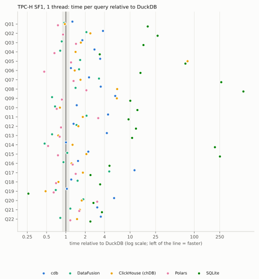
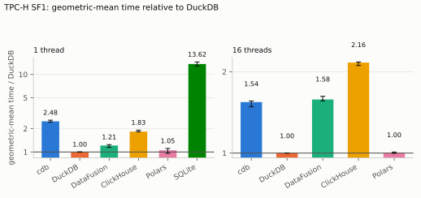
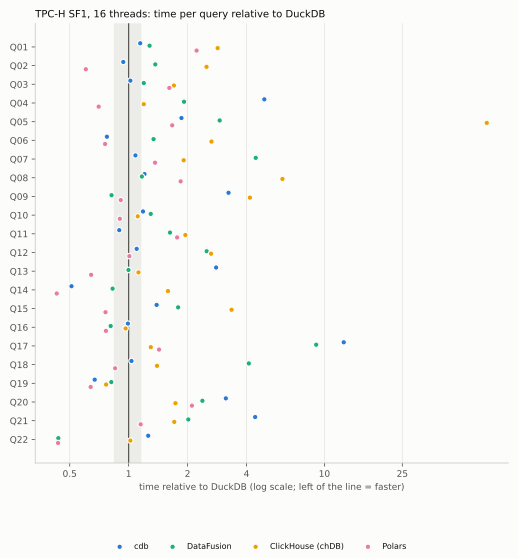
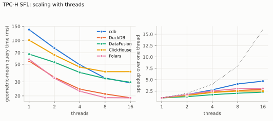
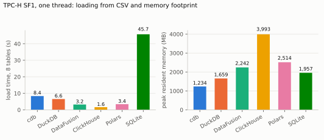
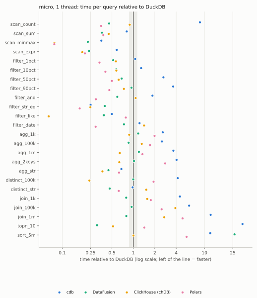
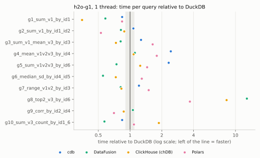
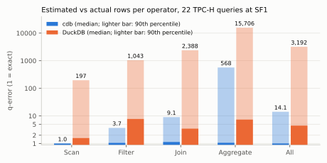
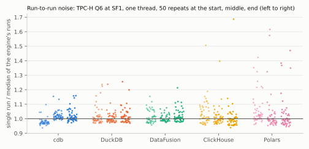
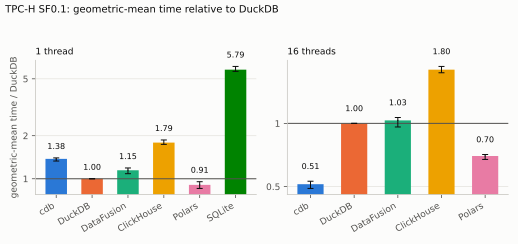

# cdb against DuckDB, DataFusion, ClickHouse, Polars and SQLite

*An evaluation of a from-scratch columnar, vectorized SQL engine: how it works, how it was built and tested, and how it
compares with the engines it is modelled on, on the standard analytical workloads.*

Measured on 2026-10-08 on one machine (AMD Ryzen 7 6800H, 8 cores / 16 threads, 14 GB) **that was in normal desktop use
while the measurements ran** (§5.1). Raw data, harness and a one-command reproduction are in the repository
(`bench/report/`); every table and number below is generated from the raw files (`bench/report/analyze.py`).

| | |
|---|---|
| [1. Summary](#1-summary) | what was measured, the headline result, the findings |
| [2. How cdb works](#2-how-cdb-works) | vectors, storage and encodings, the SQL front end, the optimizer, execution, persistence |
| [3. The systems compared](#3-the-systems-compared) | why these five, their design, where "the same query" is not the same |
| [4. Tools](#4-tools) | how the engine is built and checked; the measurement harness |
| [5. Methodology and environment](#5-methodology-and-environment) | workloads, fairness rules, **the machine and its noise** |
| [6. Results](#6-results) | correctness, TPC-H, scaling, resources, operators, H2O-style, optimizer quality, durability |
| [7. Analysis](#7-analysis-where-cdb-wins-where-it-loses-and-why) | why, from instruction-level profiles |
| [8. Threats to validity](#8-threats-to-validity-and-limitations) | what this report cannot claim |
| [9. Reproducing](#9-reproducing-this-report) | commands |
| [Appendix](#appendix) | per-query times, configuration, versions |

## 1. Summary

**What was done.** cdb, a columnar, vectorized SQL analytics engine written from scratch in C++20 (25,252 lines of engine,
26,017 lines of tests, 319 injected-bug mutants all caught by the tests), was compared with DuckDB (the
reference and the project's correctness oracle), Apache DataFusion, ClickHouse (embedded as chDB), Polars and SQLite on
TPC-H (all 22 queries, scale factors 0.1 and 1, 1 to 16 threads), 24 single-operator micro-benchmarks, the H2O.ai groupby and join
questions, the optimizer's row estimates against DuckDB's, and the cost of durability. Every engine ran in its own process
behind one measurement harness; every engine's answers were checked against DuckDB's before its timings counted.

**The result in one table** (time relative to DuckDB, geometric mean over the queries of the workload; below 1 is faster;
memory is the peak resident set on TPC-H SF1 at one thread):

| Engine | TPC-H SF1, 1 thread | SF1, 16 threads | SF0.1, 16 threads | operators, 1 thread | H2O groupby, 1 thread | H2O join, 1 thread | Peak RSS, SF1, 1 thread (MB) |
| :--- | ---: | ---: | ---: | ---: | ---: | ---: | ---: |
| cdb | 2.48 | 1.54 | 0.51 | 2.21 | 1.31 | 3.50 | 1,234 |
| DuckDB | 1 | 1 | 1 | 1 | 1 | 1 | 1,659 |
| DataFusion | 1.21 | 1.58 | 1.03 | 0.70 | 0.77 | 0.80 | 2,242 |
| ClickHouse (chDB) | 1.83 | 2.16 | 1.80 | 0.63 | 0.90 | 1.07 | 3,993 |
| Polars | 1.05 | 1.00 | 0.70 | 0.75 | 1.17 | 1.47 | 2,514 |
| SQLite | 13.62 | – | – | – | – | – | 1,957 |

**Correctness.** cdb returns the reference answer to every query of every workload at every thread count tested. DataFusion and
ClickHouse do not for TPC-H Q15 at 8 and 16 threads (a parallel floating-point sum compared with itself); cdb had the same bug
until it made its sums order-independent (§6.1).

**Speed on TPC-H SF1.** On one thread cdb takes **2.48×** DuckDB's time [2.42,
2.57]: it is the slowest of the five columnar and DataFrame engines (2.06×
DataFusion's time, 2.36× Polars', 1.36× ClickHouse's) and ahead of
SQLite only, which with indexes takes 5.5× as long. On 16 threads cdb is **1.54×**
DuckDB's time, level with DataFusion (0.98×), ahead of ClickHouse
(0.71×) and behind Polars (1.54×), because it scales better than
any of the others (4.68× from 1 to 16 threads, against DuckDB's 2.91×). On the smaller SF0.1
with 16 threads it is the fastest engine (0.51× DuckDB's time).

**Where cdb is good.** The smallest memory footprint of every engine; scans of encoded data and string predicates on dictionary
columns (faster than DuckDB on `LIKE`, string equality and string group-by); the best parallel scaling; the most accurate
row estimates of the optimizers compared (with the bias that its estimator was tuned on these 22 queries, §6.8); and a durable
commit within 24% of SQLite's time.

**Where it is not, and why** (§7, from instruction-level profiles, not from guesses):

* **Hash joins and hash aggregation** carry a generic per-row key comparison that is 13–40% of the instructions of every join and
  aggregate profiled, and there is no direct-addressed join for dense integer keys: the H2O-style joins are
  **3.50× DuckDB's time**, the worst geometric mean of the three suites.
* **Sorting and top-N** compare through a generic row comparator that is 77–81% of their instructions, and the top-N sorts
  8,192-row batches instead of keeping a boundary: the top-10 of 10 million rows is 34.24× DuckDB's time.
* **Correlated subqueries** (TPC-H Q17, Q20, Q2) are decorrelated into an aggregate over the whole inner table; Q17 is
  11.74× DuckDB's time.
* **Loading and reopening**: a `COPY` is the second slowest of the engines (8.4 s for SF1 on one thread), and a
  persistent database must be loaded whole into memory before the first query (0.32 s, against DuckDB's 0.02 s).
* **Scaling costs CPU**: at 16 threads about half the CPU time of Q4 and Q21 is spent outside any operator.

**What this says about the project.** A from-scratch engine, built and verified under a strict regime (differential testing
against an oracle, sanitizers, fuzzing, mutation testing, crash injection), runs the whole analytical benchmark correctly and lands
in the same class as DataFusion on TPC-H at 16 threads, within a small factor of DuckDB and Polars, with identifiable and
localised inefficiencies, each of which the profiles attribute to a specific function, not to the architecture: the
architecture's measurable strengths are the memory footprint, the parallel scaling and the compressed-string handling.

**What this report cannot say.** The machine was a desktop in normal use, so absolute times are noisy and pessimistic (§5.1), the
claims are ratios with intervals and a measured tie band (§5.4), and effects smaller than the band are not claimed. It is one machine,
two scale factors, default configurations, and TPC-H-*derived* queries. The author built one of the systems; §8 lists what was done
about that.

## 2. How cdb works

cdb is a columnar, vectorized SQL analytics engine written in C++20: about 25,252 lines of engine
code and 26,017 lines of tests. It is an embedded library with a small shell, in the same family as DuckDB,
ClickHouse and Velox: data is stored by column, queries run over batches of values (vectors) instead of one row at a
time, and the work is spread over cores. The design is written down decision by decision in
[`docs/adr/`](adr/) and [`docs/ARCHITECTURE.md`](ARCHITECTURE.md); this chapter is the tour a reader needs to
interpret the measurements that follow, and every claim in it can be traced to a module and a test.

```
 SQL text ─▶ lexer / parser ─▶ AST ─▶ binder ─▶ logical plan ─▶ optimizer ─▶ physical plan ─▶ pipelines
              (hand written)          names,      relational      statistics,     operators        source ▶ ops ▶ sink
                                      types,      operators       cardinality,    + local/global   run by a thread
                                      subquery    over bound      join order,     state            pool on morsels
                                      unnesting   expressions     pushdown
                                                                                                   │
        scans ◀── columnar storage: row groups of column segments (encodings, zone maps, HyperLogLog) ◀┘
                       │
                       └─ optional persistence: write-ahead log + checkpoints behind a FileSystem interface
```

### 2.1 Data model: vectors, selection vectors, strings

The unit of execution is the **vector**: up to 2,048 values of one type (16 KiB for 8-byte values, small enough that the
handful of vectors a pipeline touches stay in L1/L2). A vector is in one of three formats: *flat* (contiguous values and a
validity bitmask), *constant* (one value repeated, for literals) or *dictionary* (a child vector plus a selection vector,
which is also what a filter produces). Kernels never branch on the format inside a loop: each converts its input to a
unified view `(data, selection, validity)` once per call and indexes `data[sel[i]]`, with a specialised path for flat
inputs. NULLs are one bit per value, and a vector without NULLs carries no mask at all, so the common case costs a pointer
check instead of a bit test per row.

A **filter does not copy data**: it produces a selection vector (an array of row indices) and downstream operators read
through it, so filtering a chunk is work proportional to the rows kept. Strings are 16-byte views (a length, then either
12 inline bytes or a 4-byte prefix and a pointer), so strings up to 12 bytes need no heap, and most comparisons and
`LIKE 'abc%'` checks are decided by the prefix without a dereference.

### 2.2 Storage: row groups, immutable segments, encodings, zone maps

A table is a list of **row groups** of 122,880 rows (60 vectors); a row group holds one **column segment** per column.
Segments are immutable once sealed. A raw segment is laid out exactly like a flat vector (values, validity, sealed string
heap), so scanning it is pointing the output vector at read-only buffers: no copy, no allocation. Appends fill a mutable
builder; a full builder is sealed without copying, and `Table::Snapshot()` returns the sealed groups plus a frozen copy of
the open tail, so **readers get snapshot isolation and never take a lock while scanning**.

When a row group seals, each segment is **encoded** if that makes it at most 70% of its raw size (otherwise it stays raw,
keeping its zero-copy scans): constant, run-length, bit-packed integers (frame of reference, or per-vector deltas for
non-decreasing data), scaled doubles (`n / 10^e`, checked bit for bit, so it is lossless, with a per-vector raw fallback)
and dictionary strings (at most 2,047 entries; a dictionary segment hands out dictionary-format vectors over one shared
dictionary, so group-by and join hash each distinct string once). Decoding is per vector. On TPC-H SF1 the stored data
shrinks from 1,408 MB raw to 612 MB (2.3x).

Every segment carries **zone maps** (exact min, max and NULL count) used to skip whole row groups when a predicate cannot
match, and, since Phase 8, a **HyperLogLog sketch** of its distinct values (4,096 one-byte registers, 1.6% standard error),
built when the segment seals and merged across segments into per-table statistics for the optimizer.

### 2.3 SQL front end

A hand-written lexer and recursive-descent parser produce a syntax-only AST (every node keeps its source offset;
`parse → print → parse` is a fixpoint, tested on a corpus, all 22 TPC-H queries and fuzzed input; nesting is depth-bounded
so hostile input cannot overflow the stack). The **binder** resolves names with scopes (aliases, `USING`, derived tables),
infers types with explicit casts, folds constants, extracts aggregates under SQL's `GROUP BY / HAVING / ORDER BY` rules and
produces a logical plan of relational operators over bound expressions. A single scalar interpreter defines the semantics of
every expression and is the oracle for the vectorized kernels; it is itself checked against DuckDB on about 4,300
generated expressions.

**Subqueries are unnested while binding**, so no operator evaluates a subquery per row: `[NOT] EXISTS` and `[NOT] IN`
become semi / anti joins (`NOT IN` a null-aware anti join that implements SQL's three-valued logic), an uncorrelated scalar
subquery a cross join with its one row (guarded so that more than one row is an error), and a correlated scalar aggregate a
`LEFT` join with the aggregate grouped by the correlation keys, with the aggregate's empty-input value (`0` for `COUNT`) for
outer rows that have no group. Non-recursive `WITH` is inlined through a scope chain. Shapes outside this table (correlated
`NOT IN`, `IN` under `OR`, `WITH RECURSIVE`) fail with a positioned `NotImplemented` error rather than a wrong answer.

### 2.4 The optimizer

Phase 4 had a rule-based optimizer (filter pushdown that is aware of outer joins, OR factoring, column pruning, zone-map
hints, top-N). Phase 8 added the cost-based part:

* **Cardinality estimation** (`planner/cardinality`): rows and per-column statistics for every operator, from the table
  statistics with the textbook assumptions (independence between predicates, uniformity between the bounds, containment of
  join keys): equality is `1/distinct`, ranges are read off a grid of `distinct` values between the bounds, a lower and an
  upper bound on one column form an interval, `OR` uses inclusion–exclusion, a join of two keys has `1/max(distinct)` of the
  product of its inputs, a semi / anti join keeps the share of the left key *domain* that the right keys cover, and an
  aggregate has the product of its group columns' distinct counts.
* **Join ordering** (`planner/join_order`): a tree of inner joins is flattened into relations (with their own filters
  pushed down and estimated) and predicates; dynamic programming over subsets finds the cheapest tree up to 12 relations
  (bushy trees included; cost = rows out + 2 × rows built + rows probed; the smaller input is the build side; no cross
  product where a predicate can avoid one), a greedy left-deep order up to 60, and the order as written beyond.
* **Rules** that use the estimates: a semi / anti join sinks below an inner join only if it shrinks its input and the join
  below it is not just a comparison against a one-row subquery; filters commute past semi / anti joins.

`EXPLAIN` prints the plan with `(~N rows)`; `EXPLAIN ANALYZE` runs it and prints, per operator, estimated rows, actual rows,
the build side of each join and CPU time, which is how the estimator was debugged and how chapter 6.6 compares it with
DuckDB's.

### 2.5 Execution: push-based pipelines and morsel-driven parallelism

A physical plan is cut into **pipelines** `source → streaming operators → sink`, run in dependency order. A pipeline breaker
(hash aggregate, join build, sort, top-N) is the sink of one pipeline and the source of the next. Operators follow a
three-role protocol with **global** state shared by the threads of a pipeline and **local** state private to one: a hash
aggregate fills a thread-local table and merges it in `Combine`; a join build collects rows locally and publishes them in
`Finalize`; a satisfied `LIMIT` returns `Finished` and stops the source. The push model puts the control flow in the
pipeline rather than in the operators, so adding threads did not require changing any operator (ADR 0005).

The pool (`TaskScheduler`) is fixed-size; a pipeline runs on several threads only if its source, every operator and its sink
allow it. Each thread claims **morsels** of 8 vectors (never across a row group) from an atomic cursor. The parallel
operators:

| Operator | How it parallelises |
|---|---|
| hash aggregate | per-thread group tables merged by hash partition (from 32,768 groups; one task per partition, no locks) |
| hash join | per-thread row stores adopted whole, hashed in parallel, linked into bucket chains without atomics (radix scatter by bucket partition); probing is per thread |
| sort | parallel stable merge sort with co-rank slices, identical to the serial stable order; top-N prunes per thread first |
| CSV load | mmap, record boundaries found in parallel, whole row groups parsed, sealed and compressed per task, published in file order |

Floating-point `SUM` / `AVG` are accumulated in compensated (double-double) form and rounded once, so they are
bit-identical on any number of threads and with or without SIMD. This was found the hard way: TPC-H Q15 compares a sum with
the maximum of the same sum computed a second time, and with a plain parallel sum the two differ in the last bits and the
query returns nothing (chapter 6.1 shows two other engines still do).

Hot loops have AVX2 kernels next to scalar ones (compare a column against a constant into a selection vector, scaled-double
decode, ungrouped sum / min / max, integer hashing), dispatched at run time with `__builtin_cpu_supports`; the build never
uses `-march=native`, and a kernel is only kept if it measured faster than what the compiler already generates.

### 2.6 Persistence

A database can be a directory: `checkpoint-<epoch>.cdb` (a complete snapshot, each segment stored in its in-memory
encoding with checksums) plus `wal-<epoch>.log` (frames of `[length][CRC-32C][sequence][flags][payload]`, the last of a
statement carrying a commit flag). A commit is "validate, log + fsync, apply to memory" under one mutex; recovery loads the
newest checkpoint and replays the log, cutting a torn tail at the last complete commit. All I/O goes through a `FileSystem`
interface whose in-memory implementation models what a power cut leaves behind, which is how the crash campaign (a crash at
every write, fsync, rename and directory fsync, under six policies, then a second crash during recovery) is deterministic.
The engine is in-memory first: tables are loaded at open and scanned zero-copy, so persistence is a log plus snapshots, not a
buffer pool. Chapter 6.8 measures its costs.

### 2.7 A query end to end: TPC-H Q3

The query (TPC-H Q03, shipping priority) joins three tables, filters two of them, groups, sorts and keeps the ten best groups:

```sql
SELECT
    l_orderkey,
    sum(l_extendedprice * (1 - l_discount)) AS revenue,
    o_orderdate,
    o_shippriority
FROM
    customer,
    orders,
    lineitem
WHERE
    c_mktsegment = 'BUILDING'
    AND c_custkey = o_custkey
    AND l_orderkey = o_orderkey
    AND o_orderdate < CAST('1995-03-15' AS date)
    AND l_shipdate > CAST('1995-03-15' AS date)
GROUP BY
    l_orderkey,
    o_orderdate,
    o_shippriority
ORDER BY
    revenue DESC,
    o_orderdate
LIMIT 10
```

After parsing, binding and optimizing, cdb prints the plan with the optimizer's row estimates (`EXPLAIN`, SF1):

```
LIMIT 10  (~10 rows)
  ORDER BY revenue DESC NULLS LAST, o_orderdate ASC NULLS LAST  (~462577 rows)
    PROJECT [l_orderkey, sum((l_extendedprice * (1.0 - l_discount))) AS revenue, o_orderdate, o_shippriority]  (~462577 rows)
      AGGREGATE groups=[l_orderkey, o_orderdate, o_shippriority] aggregates=[sum((l_extendedprice * (1.0 - l_discount)))]  (~462577 rows)
        PROJECT [o_orderdate, o_shippriority, l_orderkey, l_extendedprice, l_discount]  (~462577 rows)
          JOIN INNER ON (l_orderkey = o_orderkey)  (~462577 rows)
            FILTER (l_shipdate > DATE '1995-03-15')  (~3223931 rows)
              SCAN lineitem [l_orderkey, l_extendedprice, l_discount, l_shipdate] prune(l_shipdate > 1995-03-15)  (~6001215 rows)
            JOIN INNER ON (c_custkey = o_custkey)  (~219070 rows)
              FILTER (o_orderdate < DATE '1995-03-15')  (~728803 rows)
                SCAN orders [o_orderkey, o_custkey, o_orderdate, o_shippriority] prune(o_orderdate < 1995-03-15)  (~1500000 rows)
              FILTER (c_mktsegment = 'BUILDING')  (~29982 rows)
                SCAN customer [c_custkey, c_mktsegment] prune(c_mktsegment = BUILDING)  (~150000 rows)
```

`EXPLAIN ANALYZE` runs the query (here 1 thread, warm) and adds the rows that actually came out of every operator, the number of rows each join built its hash table from, the rows each sink consumed and the CPU time of each operator's own calls:

```
LIMIT 10  (est ~10, actual 10 rows, 1.74 ms; in 11620 rows)
  ORDER BY revenue DESC NULLS LAST, o_orderdate ASC NULLS LAST  (sorted as a top-N together with the LIMIT above)
    PROJECT [l_orderkey, sum((l_extendedprice * (1.0 - l_discount))) AS revenue, o_orderdate, o_shippriority]  (est ~462577, actual 11620 rows, 0.00 ms)
      AGGREGATE groups=[l_orderkey, o_orderdate, o_shippriority] aggregates=[sum((l_extendedprice * (1.0 - l_discount)))]  (est ~462577, actual 11620 rows, 3.33 ms; in 30519 rows)
        PROJECT [o_orderdate, o_shippriority, l_orderkey, l_extendedprice, l_discount]  (est ~462577, actual 30519 rows, 0.28 ms)
          JOIN INNER ON (l_orderkey = o_orderkey)  (est ~462577, actual 30519 rows, 37.1 ms; build 147126 rows, 3.95 ms)
            FILTER (l_shipdate > DATE '1995-03-15')  (est ~3223931, actual 3241776 rows, 3.92 ms)
              SCAN lineitem [l_orderkey, l_extendedprice, l_discount, l_shipdate] prune(l_shipdate > 1995-03-15)  (est ~6001215, actual 6001215 rows, 16.1 ms)
            JOIN INNER ON (c_custkey = o_custkey)  (est ~219070, actual 147126 rows, 17.4 ms; build 30142 rows, 0.34 ms)
              FILTER (o_orderdate < DATE '1995-03-15')  (est ~728803, actual 727305 rows, 0.88 ms)
                SCAN orders [o_orderkey, o_custkey, o_orderdate, o_shippriority] prune(o_orderdate < 1995-03-15)  (est ~1500000, actual 1500000 rows, 2.92 ms)
              FILTER (c_mktsegment = 'BUILDING')  (est ~29982, actual 30142 rows, 0.40 ms)
                SCAN customer [c_custkey, c_mktsegment] prune(c_mktsegment = BUILDING)  (est ~150000, actual 150000 rows, 0.16 ms)
Planning: 0.02 ms
Execution: 86.9 ms on 1 thread, 10 rows returned
(operator times are summed over threads)
```

Reading the listing (numbers are those of the run above): the optimizer found a **bushy** plan whose two hash joins are built on
the small sides, and the query compiles to four pipelines.

1. `customer` is scanned (all 150,000 rows: no segment's zone map can rule out a market segment), filtered to 30,142 rows (estimated 29,982) and built into
   a hash table: the first join's build side.
2. `orders` is scanned, filtered to 727,305 rows (estimated 728,803), probes that table and produces 147,126 rows (estimated 219,070:
   the one visibly wrong estimate of this plan, 1.5× too high) which become the second hash table.
3. `lineitem` is scanned (6,001,215 rows, 16.1 ms), filtered to 3,241,776 rows (estimated 3,223,931), probes the second table
   (37.1 ms, the largest cost of the query) and feeds the hash aggregate: 30,519 joined rows fall into 11,620 groups (the estimate of
   462,577 groups is a large over-estimate and harmless here, nothing downstream depends on it).
4. The aggregate is the source of the top-N sink, which `ORDER BY ... LIMIT` was turned into ("sorted as a top-N together with the
   LIMIT above"): it keeps the ten best of 11,620 rows.

Every operator in the listing works on vectors of up to 2,048 rows, and with more threads pipelines 1 to 3 are run by several threads
over morsels of their source. DuckDB's plan for the same query produces the same number of join rows (§6.8, Q3: 177,645 for both
engines in the SF1 comparison), so this is a query on which the two optimizers agree.

### 2.8 What cdb does not have

No spill to disk (hash tables, sorts and the whole database are in memory), no window functions, `UPDATE` / `DELETE`,
`FULL` joins, `WITH RECURSIVE`, histograms, or semi-join reduction of decorrelated aggregates; `INTERVAL` arithmetic works
on constants only; one writer at a time; no group commit (every commit pays its own fsync). The tables of chapter 6 mark
every place where one of these decides a result, as `n/a` or as a cost.

## 3. The systems compared

### 3.1 Why these five

The question is "how does a from-scratch columnar, vectorized engine compare with the engines it is modelled on and with the
standard alternatives", so the comparison set is chosen by *role*, not by availability alone:

| Engine (version) | Role in the comparison | Why it is here |
|---|---|---|
| **DuckDB** 1.5.6 | the reference | Same design family (embedded, columnar, vectorized, push-based, morsel-driven) and the correctness oracle of the whole project; every other number is read against it. |
| **Apache DataFusion** 54.1.0 | the closest architectural peer | Rust, Apache Arrow memory, a vectorized engine with its own optimizer, used as the SQL layer of many systems; the other widely used open-source embeddable columnar SQL engine. |
| **ClickHouse** 26.9.2.1 (embedded as chDB 4.4.0) | the industry reference for vectorized columnar analytics | The system ClickBench and most analytical-database comparisons are built around; chDB runs the unmodified ClickHouse engine in-process, so it can be driven exactly like the others. |
| **Polars** 2.0.0 | the DataFrame reference | The high-performance single-node DataFrame engine, benchmarked on TPC-H (`polars-benchmark`) and the H2O.ai benchmark; its queries are written against its lazy API rather than in SQL, which makes it a different kind of peer (§3.3). |
| **SQLite** 3.53.4 | the row-store baseline | The most deployed embedded database: B-tree row storage and a row-at-a-time bytecode interpreter. It shows what columnar + vectorized execution buys, and is the natural peer for durable commit latency. |

Not included, and why: PostgreSQL (needs a server install and root, which this machine does not give), Velox and Umbra / HyPer
(libraries or research systems that cannot be installed and driven like the others here), MonetDB (no maintained embedded
build). The TPC-H and H2O.ai benchmarks are the standard workloads for exactly this set of engines.

### 3.2 Design axes

What follows summarises each project's own documentation, not anything this report measured; the harness measured only the
thread counts actually used, resident memory and the timings (chapters 5 and 6).

| | cdb | DuckDB | DataFusion | ClickHouse (chDB) | Polars | SQLite |
|---|---|---|---|---|---|---|
| Language | C++20 | C++ | Rust | C++ | Rust | C |
| Kind | embedded library | embedded database | query-engine library | database server, embedded here | DataFrame library with a SQL front end | embedded database |
| Data layout | columnar; 122,880-row row groups of immutable, encoded segments | columnar; row groups | columnar Arrow record batches (no storage engine of its own) | columnar parts (MergeTree) or in-memory blocks (Memory) | columnar Arrow-compatible frames | B-tree pages of rows |
| Execution | push-based pipelines over 2,048-value vectors | push-based pipelines over vectors | pull-based streams of Arrow batches (8,192 rows by default) | pipeline of processors over blocks | lazy plan executed over columns | one row at a time in a bytecode VM |
| Parallelism | morsel-driven thread pool | morsel-driven thread pool | partitions (`target_partitions`) on an async runtime | `max_threads` pipeline streams | a global thread pool | one thread per query |
| Optimizer | rule-based plus cost-based join order from HyperLogLog statistics | rule-based plus cost-based, with statistics | rule-based, with statistics for join build side | rule- and heuristic-based | lazy rule-based (pushdowns, common-subplan elimination) | cost-based planner for indexes (statistics from `ANALYZE`) |
| Compression | lightweight per-segment encodings (frame of reference, RLE, dictionary, scaled doubles) | lightweight in database files | none in memory | codecs in MergeTree parts | none (Arrow layout) | none |
| Durability | write-ahead log + checkpoints, fsync per commit | write-ahead log + checkpoints | none | MergeTree parts on disk | none | journal / WAL |
| SIMD | AVX2 kernels, run-time dispatch | compiler + explicit | compiler (Arrow kernels) | explicit, run-time dispatch | explicit + compiler | none |

### 3.3 Where "the same query" is not the same

* **DuckDB and cdb** run the same SQL text (the queries exported from DuckDB's `tpch` extension) and both answer to the
  DuckDB answer files. DuckDB is also run with its native `DECIMAL(15,2)` money columns as a second row; the primary
  comparison gives every engine `DOUBLE` money columns, as cdb stores them (ADR 0003).
* **DataFusion** runs the same SQL text unchanged and passes all 22 queries.
* **ClickHouse** runs the same SQL text with three non-default settings, each required for SQL-standard results:
  `join_use_nulls = 1` (a `LEFT JOIN` pads with NULL, not with the type's default: TPC-H Q13 counts a non-existent order
  otherwise), `aggregate_functions_null_for_empty = 1` (an aggregate over no rows is NULL, not 0: Q17 at small scale
  factors) and `input_format_csv_trim_whitespaces = 0` (the loader must not trim the spaces TPC-H comments begin and end
  with). Two table engines are measured: `Memory` (data in RAM, the like-for-like row) and `MergeTree` (its normal storage;
  its page cache is warm).
* **SQLite** runs the same text rewritten mechanically for its dialect (`bench/report/make_sqlite_queries.py`: dates as ISO
  text, `strftime` and `substr` for `EXTRACT` and `SUBSTRING`, Q13's derived-table column list) and, as it is a
  row store without a statistics-driven join order, with the standard TPC-H primary- and foreign-key indexes (listed in
  `py_worker.py`) and `ANALYZE`; without indexes most queries would not finish.
* **Polars** runs the 22 DataFrame-API queries of `pola-rs/polars-benchmark` (Apache 2.0) with three mechanical changes that
  do not change the work (the tables come from memory, `.round(2)` formatting is removed so the answers compare exactly with
  the answer files, Q11's threshold fraction is the SQL text's constant). For the micro-benchmark and H2O-style workloads,
  which have no published Polars versions, Polars' own SQL interface runs the same SQL as the others. So the Polars rows
  measure Polars' hand-tuned DataFrame queries against everyone else's SQL: a favourable comparison for Polars by
  construction, and said so wherever it matters.

## 4. Tools

### 4.1 How the engine is built and checked

| Purpose | Tool | Used for |
|---|---|---|
| Build | CMake presets (`debug`, `release`, `asan`, `tsan`, `fuzz`), Ninja, GCC 13.3 and Clang 18 | one source tree, every preset in CI; `-Werror`; never `-march=native` (hot kernels dispatch at run time) |
| Unit and property tests | GoogleTest: 976 test cases | every data structure across formats × types × NULLs; each operator against a naive reference; randomized tests against a simple model |
| SQL tests | sqllogictest-style runner over `tests/sql/*.test` | ~350 queries whose expected results are generated by DuckDB (`tools/gen_slt.py`) |
| Oracle | DuckDB (pinned), `tools/tpch_data.py` | TPC-H data (`dbgen`) and the answer files of all 22 queries; every disagreement is a bug in cdb until proven otherwise |
| Differential fuzzing | `tools/fuzz_sql.py` | random schemas and queries (every join kind, aggregates, derived tables, CTEs, every subquery shape) answered by DuckDB, run against cdb with the optimizer on and off; 1,200 per gate, tens of thousands per campaign |
| Sanitizers | ASan + UBSan, TSan | the whole suite under each, also in a stress mode (`-parallel`: 4 threads, one-vector morsels, every parallel threshold at 1). UBSan found a latent shift-by-negative in the parallel join build in Phase 8 |
| Fuzzing | libFuzzer targets | the parser, the checkpoint reader and log recovery, seeded from valid inputs |
| Crash testing | `MemoryFileSystem` with a power-cut model, `FaultInjector`, real `kill -9` | a crash at every mutating I/O operation of several workloads under six policies, then a second crash during recovery; I/O errors at every operation; every bit flip and truncation of a checkpoint detected |
| Mutation testing | `tools/mutation_smoke.py` | 319 injected bugs (one at a time, in an isolated worktree); a surviving mutant is a test gap. The Phase 8 run left seven alive, fixed by new tests |
| Gate | `tools/verify.sh` | format + debug / ASan / TSan / release / Clang 18, each in default and `-parallel` mode, plus the TPC-H SF0.01 differential and 1,200 fuzz queries; required before every push |
| CI | GitHub Actions | the same matrix on every push |

### 4.2 How performance is measured

| Tool | What it does |
|---|---|
| `bench/tpch/tpch_runner.cpp` (`cdb_tpch`) | loads TPC-H and times whole queries end to end (parse, bind, optimize, plan, execute, materialise); the tool behind `docs/BENCHMARKS.md` |
| `bench/persist/persist_bench.cpp` (`cdb_persist`) | commit latency with and without fsync, checkpoint and recovery times on a real disk |
| Google Benchmark (`cdb_bench`) | kernel and data-structure micro-benchmarks (copy, validity masks, string compare, encodings, SIMD kernels) |
| `tools/stats_accuracy.py`, `tools/optimizer_ablation.py`, `tools/bench_table.py` | sketch accuracy and estimated-vs-actual rows, optimizer on / off per query, the comparison tables of `BENCHMARKS.md` |
| callgrind (valgrind) | instruction-level profiles; `perf` is not installed on the test machine and cannot be (no root), so hardware counters are not used anywhere in this report |
| **The comparison harness (this report)** | `bench/report/`: below |

### 4.3 The comparison harness

Everything in chapter 6 comes from one harness (`bench/report/`, about 4,190 lines):

* **Workers.** Each engine runs in its own process behind one line protocol (`THREADS`, `LOADSPEC`, `EXEC`, `RUN`, `DUMP`,
  `STAT`): `cdb_report_worker` (C++, links the engine) and `py_worker.py` (DuckDB, DataFusion, chDB, Polars, SQLite).
  The same driver therefore loads, times, verifies and measures all of them identically, and measures memory from outside
  (`VmHWM` of the worker's `/proc/<pid>/status`), never from the engine's own accounting.
* **Timing.** The worker takes `perf_counter` / `steady_clock` around the call that runs the query *and* materialises the
  whole result in the engine's customary in-memory form (Arrow tables / record batches where the engine has them, a
  `QueryResult` for cdb, row tuples for SQLite), and `getrusage` / `process_time` around it for CPU time.
* **Visits and rounds.** A *visit* is a fresh worker: load, then for each query one cold run and three warm runs (one more
  run only, if the cold run took over 10 s). A *round* is one visit of every engine, in an order that rotates between
  rounds, so that whatever the machine is doing is spread over the engines instead of landing on one.
* **Verification.** Before any timing counts, `driver.py verify` dumps every engine's answer to every query and compares it
  with DuckDB's answer file (relative tolerance 1e-7 on numbers, exact on text and dates, order-insensitive only inside
  ties of the `ORDER BY`). For the micro-benchmarks and the H2O-style workloads the reference answers are DuckDB's fresh
  answers on the same data.
* **Probes.** Before and after every visit a control probe runs (a fixed interpreter loop and a large array copy: their
  speed follows CPU frequency and contention), together with the load average, free memory, the frequency of every core and
  the CPU the *rest* of the machine used while the visit ran (`/proc/stat` minus the worker's own jiffies).
* **Analysis.** `analyze.py` turns the raw JSON lines into the tables and charts below; `make_report.py` fills this
  document's template from them, so no number in the tables or in the prose marked as generated was typed by hand.

The data is generated once (TPC-H by DuckDB's `dbgen` through `tools/tpch_data.py`; the micro-benchmark and H2O-style
tables by `workloads.py` with a fixed seed) and read by every engine from the same CSV files.

## 5. Methodology and environment

### 5.1 The machine, and what else it was doing

| | |
|---|---|
| CPU | AMD Ryzen 7 6800H, 8 cores / 16 threads, AVX2, no AVX-512; L1d 32 KiB and L2 512 KiB per core, L3 16 MiB |
| Memory | 14 GB (about 5–7 GB available during the runs) |
| Disk | NVMe, ext4 (page cache warm for the durability numbers) |
| OS | Linux 7.0, Ubuntu 24.04; Python 3.14.7; GCC 13.3 `-O3 -DNDEBUG` (no `-march=native`) |
| CPU governor | `powersave`, boost enabled, **not changeable** (no root) |

> **These measurements were taken on a desktop in normal use, not on an idle, isolated machine.** Two web browsers (holding
> about 5 GB of the memory), an editor and a coding-assistant session were open, and the owner had said the machine would be
> used normally while the campaign ran. No cores were reserved, the governor stayed on `powersave`, and there was no control over frequency scaling:
> the mean CPU frequency during the runs was 2.2 GHz (per-core readings between 1.1 and
> 4.6 GHz), well below the part's boost clock, and it moved with load. The rest of the machine used a median
> of **0.9 cores** while a benchmark ran (90th percentile 1.3, maximum 2.2; one core is
> 6% of the machine). Absolute times in this report are therefore pessimistic and noisier than an isolated machine would
> give; what is defended is the *comparison*, by the design below. Every claim of "faster" or "slower" in chapter 6 is made
> against the measured noise floor of §5.4 and carries an interval; where it does not clear it, the report says "tie".

### 5.2 Workloads and data

| Workload | Data | Queries | Why |
|---|---|---|---|
| **TPC-H** | scale factors 0.1 (600,572 `lineitem` rows), 1 (6,001,215 rows) (SF3 was not run: the desktop did not leave enough free memory); generated by DuckDB's `dbgen`, read by every engine from the same CSV files | the 22 queries, as exported from DuckDB's `tpch` extension | the standard analytical benchmark; joins, subqueries, aggregation, sorting, string predicates |
| **Operator micro-benchmarks** | one fact table of 10,000,000 rows (a sequential id, three integer keys of 1,000 / 100,000 / 1,000,000 distinct values, an integer uniform on [0, 100,000), a two-decimal double, a 1,000-value string, a date over seven years) and three dimension tables of 1,000 / 100,000 / 1,000,000 rows, fixed seed | 24 single-operator queries: scans, filters of 1% to 90% selectivity, `LIKE`, hash aggregation by group cardinality, `COUNT DISTINCT`, hash joins by build-side size, top-N and a 5,000,000-row sort | isolates one mechanism at a time, so a TPC-H gap can be traced to an operator |
| **H2O.ai db-benchmark style** | `groupby` (10,000,000 rows, 100 groups, K = 100) and `join` (10,000,000-row table against 10, 10,000 and 10,000,000-row tables); **re-created from the published description with a fixed seed, not the original generator** | the ten groupby questions and five join questions; questions that need `median`, `stddev`, `corr` or window functions are `n/a` for cdb | the standard workload of the DuckDB / Polars / DataFusion / ClickHouse community; simple enough that every engine runs it |
| **Optimizer quality** | TPC-H SF1 | per-operator estimated vs actual rows (cdb's `EXPLAIN ANALYZE`, DuckDB's JSON profile) | the optimizer is a feature of its own, and q-error is how it is judged |
| **Durability and ingest** | TPC-H SF1 as files; single-row inserts | commit latency (autocommit), bulk load into a persistent database, size on disk, reopen | the cost of keeping data safe |

### 5.3 What is measured, and how every engine is treated alike

* **Metric.** Wall-clock time of one query execution including the materialisation of the full result; the *median of the
  warm runs of a round* is the sample, the **median over rounds** the reported value, with a 95% bootstrap interval over
  rounds. "Cold" is the first execution in a fresh process. Every table says which.
* **Geometric means** are taken per round over the queries every compared engine completed, then summarised over rounds;
  ratios to DuckDB are taken within a round (both engines were measured minutes apart under the same conditions) and
  summarised over rounds, so a quiet or busy stretch cancels instead of masquerading as a difference.
* **Threads.** 1, 2, 4, 8 and 16 threads (SQLite: 1). The thread count each engine really used is checked from the worker
  (OS thread count, CPU time / wall time).
* **Defaults.** Every engine runs with its default configuration except the thread count and the ClickHouse settings of
  §3.3; the appendix lists every setting.
* **In memory.** Tables are resident (DuckDB `:memory:`, DataFusion `MemTable` with one partition per thread, ClickHouse
  `Memory` tables with `MergeTree` as a second row, Polars frames, SQLite `:memory:`).
* **Correctness first.** A timing is only reported next to a verified answer: the verification status of every engine and
  query is in §6.1. A query that fails verification is marked ✗ in the tables, not hidden.
* **Memory guard.** A visit starts only when free memory exceeds 1.3× the engine's expected footprint (the desktop is never
  pushed into swap), and waits otherwise.
* **Timeouts.** A query that does not finish in 300 s (SQLite: 120 s) is reported as DNF, never dropped from a mean
  silently: geometric means are over the queries all compared engines finished, and the table says which.

### 5.4 Handling the noise

1. **Interleaved rounds** (§4.3). Five rounds for TPC-H at SF0.1 and SF1 on 1 and 16 threads, three for the intermediate thread
   counts (2, 4, 8), the variants, and the micro-benchmark and H2O-style workloads; the engine order rotates every round.
2. **Flagged visits are repeated.** A visit is flagged when either control probe is more than 15% slower than the median of
   the visits before it, or the rest of the machine used more than 2.5 cores during it; a flagged visit is run again (up to
   twice) and all attempts are kept in the raw files. 258 visits were run in all,
   1 of them repeats of a flagged visit, and 0 remained flagged after two retries (such a
   visit would be used as it is and marked in the raw data).
3. **The noise floor is measured, not assumed.** Two measurements. (a) The same query on the same engine was repeated
   alone, 30–50 times, at the start, in the middle and at the end of the campaign (§6.10): single runs of one query vary
   between 2% and 22% (p10–p90 spread, relative to the median) at one thread, and up to
   47% at 16 threads for a 5–8 ms query; the 90th percentile of the spread over all engines tested is
   15% at one thread and 43% at 16 threads. (b) What matters is the noise of the statistic that is actually compared: a per-query ratio to DuckDB, taken
   within a round and summarised by its median over rounds. Its round-to-round relative interquartile range, at the 90th
   percentile over queries and engines, is the **tie band τ** of a configuration: τ = 12% for TPC-H SF1 on one
   thread and 15% on 16 threads (every configuration's band is in appendix A.7). A per-query
   ratio is called a difference only if its 95% interval excludes 1 *and* it differs from 1 by more than τ; otherwise
   the tables mark it "≈".
4. **Ratios are the claim, absolute times are context.** A reader who wants to compare with another machine should compare
   ratios.

### 5.5 What this methodology cannot do

It cannot make a shared desktop behave like an isolated one: noise was reduced and *bounded*, not removed. It cannot show
effects smaller than τ. It does not use hardware performance counters (not available), so explanations in chapter 7 rest on
instruction-level simulation (callgrind) and on controlled experiments, not on measured cache-miss rates. It runs on one
machine, one CPU generation, one operating system.

## 6. Results

How to read the tables. Times are medians over rounds of the median of three warm runs, in milliseconds, unless a table
says otherwise; ratios are *time of the engine ÷ time of DuckDB*, taken within each round and summarised by their median, so
**below 1 is faster than DuckDB**. "≈" marks a ratio that is not distinguishable from 1 (its 95% interval contains 1, or it
is within the tie band τ of its configuration, §5.4). ✗ marks a result that failed verification (§6.1). Intervals in
brackets are 95% bootstrap intervals over rounds. Everything in this chapter is regenerated from the raw files by
`bench/report/analyze.py`.

### 6.1 Correctness

Before any timing is reported, every engine's answer to every query was compared with the reference (DuckDB's answer files for
TPC-H; DuckDB's fresh answers on the same data for the other workloads) at every thread count that was timed.

| Engine | H2O groupby, 1 thr | H2O groupby, 16 thr | H2O join, 1 thr | H2O join, 16 thr | micro, 1 thr | micro, 16 thr | TPC-H SF0.1, 1 thr | TPC-H SF0.1, 16 thr | TPC-H SF1, 1 thr | TPC-H SF1, 16 thr | Not matching the reference answer |
| :--- | ---: | ---: | ---: | ---: | ---: | ---: | ---: | ---: | ---: | ---: | :--- |
| cdb | 7 / 7 | 7 / 7 | 5 / 5 | 5 / 5 | 24 / 24 | 24 / 24 | 22 / 22 | 22 / 22 | 22 / 22 | 22 / 22 | all answers match |
| DuckDB | 10 / 10 | 10 / 10 | 5 / 5 | 5 / 5 | 24 / 24 | 24 / 24 | 22 / 22 | 22 / 22 | 22 / 22 | 22 / 22 | all answers match |
| DataFusion | 10 / 10 | 10 / 10 | 5 / 5 | 5 / 5 | 24 / 24 | 24 / 24 | 22 / 22 | 22 / 22 | 22 / 22 | 21 / 22 | Q15 (mismatch: 0 rows, expected 1) at sf1_t16 |
| ClickHouse (chDB) | 10 / 10 | 10 / 10 | 5 / 5 | 5 / 5 | 24 / 24 | 24 / 24 | 22 / 22 | 22 / 22 | 22 / 22 | 21 / 22 | Q15 (mismatch: 0 rows, expected 1) at sf1_t16 |
| Polars | 10 / 10 | 10 / 10 | 5 / 5 | 5 / 5 | 24 / 24 | 24 / 24 | 22 / 22 | 22 / 22 | 22 / 22 | 22 / 22 | all answers match |
| SQLite | – | – | – | – | – | – | 22 / 22 | – | 22 / 22 | – | all answers match |
| DuckDB (DECIMAL) | – | – | – | – | – | – | 22 / 22 | 22 / 22 | 22 / 22 | 22 / 22 | all answers match |
| ClickHouse (MergeTree) | – | – | – | – | – | – | 22 / 22 | 22 / 22 | 22 / 22 | 21 / 22 | Q15 (mismatch: 0 rows, expected 1) at sf1_t16 |

Every engine returns the reference answer for every query it can express, with two exceptions that are about the engines
and not about the harness:

* **DataFusion and ClickHouse return no row for TPC-H Q15 at 8 and 16 threads** (they are correct on one thread). Q15 asks
  for the supplier whose revenue *equals* the maximum revenue, and the revenue is the same parallel floating-point sum
  computed twice; with more than one thread the two sums differ in their last bits, so the equality finds nothing. cdb had the
  same defect until Phase 8, when it made `SUM` / `AVG` of doubles order-independent (compensated accumulation, rounded once,
  at a cost of about 30% on TPC-H Q1 against the build before it, `BENCHMARKS.md`); DuckDB and Polars return the right row at every thread count. The timing of
  Q15 for the two affected engines is reported (the work done is the same) and marked ✗.
* **Polars on Q17 at SF0.01** (a dry run, not part of the timed results) returned `0` where the reference has `NULL`: a sum
  over no rows is `0` in Polars. At the timed scale factors Q17 matches.

The H2O-style groupby questions have no `ORDER BY`, so their answers are compared as sets of rows.

### 6.2 TPC-H, scale factor 1, one thread

One thread is the headline comparison: the engines do the same work on the same core, and it is the configuration least
disturbed by the desktop (§5.4). τ = 12%.



| Query | cdb | DuckDB | DataFusion | ClickHouse (chDB) | Polars | SQLite |
| :--- | ---: | ---: | ---: | ---: | ---: | ---: |
| Q01 | 1.26 | 1 | 0.94 ≈ | 0.96 ≈ | 0.75 | 18.86 |
| Q02 | 3.79 | 1 | 2.09 | 2.41 | 0.90 ≈ | 26.89 |
| Q03 | 1.80 | 1 | 0.86 ≈ | 1.71 | 1.44 | 16.17 |
| Q04 | 2.79 | 1 | 0.82 | 1.42 | 0.66 | 3.37 |
| Q05 | 3.42 | 1 | 1.67 | 78.73 | 1.20 | 72.83 |
| Q06 | 1.20 | 1 | 1.60 | 1.37 | 0.46 | 14.52 |
| Q07 | 2.29 | 1 | 3.28 | 1.69 | 1.32 | 263.70 |
| Q08 | 3.49 | 1 | 1.41 | 6.30 | 2.08 | 583.58 |
| Q09 | 5.87 | 1 | 0.61 | 6.23 | 0.87 | 10.08 |
| Q10 | 1.48 | 1 | 0.68 | 0.81 | 0.72 | 13.01 |
| Q11 | 4.54 | 1 | 2.10 | 1.84 | 3.19 | 9.47 |
| Q12 | 1.32 | 1 | 1.47 | 1.57 | 0.84 | 12.37 |
| Q13 | 4.35 | 1 | 0.61 | 0.76 | 0.80 | 10.77 |
| Q14 | 1.00 ≈ | 1 | 0.47 | 1.27 | 0.53 | 210.03 |
| Q15 | 2.23 | 1 | 1.05 ≈ | 2.08 | 0.75 | 251.41 |
| Q16 | 1.55 | 1 | 0.92 ≈ | 1.23 | 1.28 | 4.78 |
| Q17 | 11.74 | 1 | 4.74 | 1.84 | 1.42 | 2.42 |
| Q18 | 1.21 | 1 | 1.52 | 0.77 | 0.70 | 3.42 |
| Q19 | 1.04 ≈ | 1 | 0.70 | 0.48 | 0.65 | 0.26 |
| Q20 | 5.64 | 1 | 1.87 | 1.77 | 3.08 | 2.69 |
| Q21 | 3.08 | 1 | 1.17 | 1.65 | 1.62 | 3.65 |
| Q22 | 3.50 | 1 | 0.82 | 1.49 | 1.17 | 2.41 |
| **geometric mean** | **2.48** [2.42, 2.57] | **1** | **1.21** [1.15, 1.24] | **1.83** [1.82, 1.91] | **1.05** [0.96, 1.11] | **13.62** [12.81, 14.47] |



* **cdb is 2.48× DuckDB's time** [2.42, 2.57] over the 22
  queries: slower on 20, tied on 2 and faster on
  0 (the geometric mean of the times is 136.48 ms against 54.98 ms).
  That is the same order as the 2.31× that the simpler single-engine harness of `docs/BENCHMARKS.md` measured two days earlier.
* The other engines, against DuckDB: DataFusion 1.21×, **Polars 1.05×**
  (parity, on hand-written DataFrame queries), ClickHouse 1.83×, SQLite 13.62× (with
  indexes). **On one thread cdb is the slowest of the five columnar and DataFrame engines**: it takes
  2.06× DataFusion's time, 2.36× Polars' and
  1.36× ClickHouse's (faster than ClickHouse on 4 queries, tied on
  4, slower on 14); it is ahead only of SQLite, which needs
  5.5× cdb's time even with indexes.

| cdb against | Queries | cdb time / their time (geometric mean) [95% interval] | cdb faster | tie | cdb slower |
| :--- | ---: | ---: | ---: | ---: | ---: |
| DuckDB | 22 | 2.48 [2.42, 2.57] | 0 | 2 | 20 |
| DataFusion | 22 | 2.06 [1.95, 2.24] | 3 | 1 | 18 |
| ClickHouse (chDB) | 22 | 1.36 [1.30, 1.41] | 4 | 4 | 14 |
| Polars | 22 | 2.36 [2.25, 2.67] | 0 | 0 | 22 |
| SQLite | 22 | 0.18 [0.17, 0.20] | 18 | 0 | 4 |

* **Where cdb is far from DuckDB** (ratio to DuckDB): Q17 11.74×, Q9 5.87×,
  Q20 5.64×, Q11 4.54×, Q13 4.35×, Q2
  3.79×, Q8 3.49×, Q5 3.42×. **Where it is close:** Q14
  (1.00) and Q19 (1.04) are ties, and the scan-and-aggregate queries Q6
  (1.20×), Q1 (1.26×), Q12 (1.32×) and Q18
  (1.21×) are within a third. The pattern (the scan-heavy queries are near parity, the gaps are in
  queries with correlated subqueries, many joins or big sorts) is the subject of chapter 7.
* **ClickHouse is an outlier on the multi-join queries**: Q5 is 78.73× DuckDB's time, Q8
  6.30× and Q9 6.23×, against 1.83× overall. Its default
  configuration was used throughout (§5.3), and it most likely joins in the order the query is written; this was not
  investigated, and a hand-tuned ClickHouse would be closer.

Which engine is fastest on how many queries, one thread:

| Engine | Queries on which it is fastest |
| :--- | ---: |
| cdb | 0 |
| DuckDB | 7 |
| DataFusion | 7 |
| ClickHouse (chDB) | 0 |
| Polars | 7 |
| SQLite | 1 |

The full per-query times are in appendix A.1. Cold runs (the first execution in a fresh process) cost little more than warm ones:

| Engine | Cold (geometric mean, ms) | Warm (ms) | Cold / warm |
| :--- | ---: | ---: | ---: |
| cdb | 144 | 136 | 1.06 |
| DuckDB | 58.7 | 55.0 | 1.07 |
| DataFusion | 70.6 | 66.3 | 1.06 |
| ClickHouse (chDB) | 121 | 101 | 1.20 |
| Polars | 68.3 | 57.3 | 1.19 |
| SQLite | 757 | 752 | 1.01 |

### 6.3 TPC-H, scale factor 1, 16 threads, and scaling

τ = 15%. The desktop competes for these cores, so the intervals are wider (§5.1).



| Query | cdb | DuckDB | DataFusion | ClickHouse (chDB) | Polars |
| :--- | ---: | ---: | ---: | ---: | ---: |
| Q01 | 1.15 ≈ | 1 | 1.28 | 2.85 | 2.22 |
| Q02 | 0.94 ≈ | 1 | 1.37 | 2.50 | 0.60 |
| Q03 | 1.02 ≈ | 1 | 1.19 | 1.70 | 1.61 |
| Q04 | 4.93 | 1 | 1.92 | 1.19 ≈ | 0.70 |
| Q05 | 1.86 | 1 | 2.92 | 67.51 | 1.67 |
| Q06 | 0.77 | 1 | 1.34 | 2.65 | 0.76 |
| Q07 | 1.08 ≈ | 1 | 4.46 | 1.91 | 1.36 |
| Q08 | 1.20 | 1 | 1.17 | 6.10 | 1.84 |
| Q09 | 3.24 | 1 | 0.82 ≈ | 4.16 | 0.91 ≈ |
| Q10 | 1.18 | 1 | 1.30 | 1.11 ≈ | 0.90 ≈ |
| Q11 | 0.90 ≈ | 1 | 1.63 | 1.95 | 1.77 |
| Q12 | 1.10 ≈ | 1 | 2.50 | 2.64 | 1.01 ≈ |
| Q13 | 2.80 | 1 | 1.00 ≈ | 1.12 ≈ | 0.64 |
| Q14 | 0.51 | 1 | 0.83 | 1.59 | 0.43 |
| Q15 | 1.39 | 1 | 1.79 | 3.36 | 0.76 |
| Q16 | 0.99 ≈ | 1 | 0.81 | 0.96 ≈ | 0.77 |
| Q17 | 12.55 | 1 | 9.08 | 1.30 | 1.43 |
| Q18 | 1.03 ≈ | 1 | 4.11 | 1.40 | 0.85 ≈ |
| Q19 | 0.67 | 1 | 0.82 | 0.77 | 0.64 |
| Q20 | 3.14 | 1 | 2.38 | 1.73 | 2.10 |
| Q21 | 4.43 | 1 | 2.02 | 1.71 | 1.15 ≈ |
| Q22 | 1.26 | 1 | 0.44 | 1.02 ≈ | 0.44 |
| **geometric mean** | **1.54** [1.48, 1.56] | **1** | **1.58** [1.56, 1.62] | **2.16** [2.11, 2.17] | **1.00** [1.00, 1.01] |

* **cdb is 1.54× DuckDB's time** [1.48, 1.56] at 16 threads:
  closer than on one thread because it scales better. Of the 22 queries it is tied on 8,
  slower on 11 and faster on 3. DataFusion
  1.58×, ClickHouse 2.16×, Polars 1.00×. cdb against
  DataFusion: 0.98× (a tie overall: 9 faster,
  5 tied, 8 slower); against ClickHouse
  0.71×; against Polars 1.54×.
* The queries where cdb remains far behind at 16 threads are the same ones as on one thread (Q17 12.55×,
  Q4 4.93×, Q21 4.43×, Q9 3.24×, Q20
  3.14×, Q13 2.80×); Q4 and Q21 are newly slow because they do not scale
  (§7.3 shows where their CPU goes). It is faster than DuckDB on Q14 (0.51×).

**Scaling.** Geometric-mean time over the 22 queries, and the speedup over one thread (SF1):



| Engine | 1 thr | 2 thr | 4 thr | 8 thr | 16 thr |
| :--- | ---: | ---: | ---: | ---: | ---: |
| cdb | 136 (1.0x) | 79.8 (1.7x) | 49.3 (2.8x) | 33.6 (4.1x) | 29.2 (4.7x) |
| DuckDB | 55.0 (1.0x) | 34.2 (1.6x) | 24.3 (2.3x) | 21.2 (2.6x) | 18.9 (2.9x) |
| DataFusion | 67.1 (1.0x) | 53.0 (1.3x) | 39.5 (1.7x) | 33.1 (2.0x) | 29.7 (2.3x) |
| ClickHouse (chDB) | 101 (1.0x) | 65.6 (1.5x) | 46.0 (2.2x) | 40.4 (2.5x) | 40.4 (2.5x) |
| Polars | 57.7 (1.0x) | 33.4 (1.7x) | 22.9 (2.5x) | 19.0 (3.0x) | 18.9 (3.1x) |

cdb has the best scaling of the engines in this comparison (4.68× on 16 threads, of which 8 are physical
cores) against DuckDB's 2.91×, Polars' 3.05×, DataFusion's 2.26× and
ClickHouse's 2.49×; it reaches DataFusion at 8 threads and is 1.58× DuckDB's time there. But
it does so by using more CPU: 12.5 CPU-seconds for one pass over the 22 queries at 16 threads against DuckDB's
4.2 (2.9×; on one thread 5.0 against 1.9, 2.7×): the
inefficiencies of §7.2 and, at 16 threads, the waiting of §7.3.

| Engine | Threads | Queries | Sum of wall times (s) | Sum of CPU times (s) | Effective parallelism (CPU / wall) |
| :--- | ---: | ---: | ---: | ---: | ---: |
| cdb | 1 | 22 | 4.95 | 4.95 | 1.0 |
| DuckDB | 1 | 22 | 1.86 | 1.86 | 1.0 |
| DataFusion | 1 | 22 | 2.14 | 2.14 | 1.0 |
| ClickHouse (chDB) | 1 | 22 | 7.43 | 7.50 | 1.0 |
| Polars | 1 | 22 | 1.79 | 1.82 | 1.0 |
| SQLite | 1 | 22 | 63.76 | 63.74 | 1.0 |
| cdb | 16 | 22 | 1.13 | 12.51 | 11.1 |
| DuckDB | 16 | 22 | 0.51 | 4.24 | 8.3 |
| DataFusion | 16 | 22 | 0.96 | 9.11 | 9.5 |
| ClickHouse (chDB) | 16 | 22 | 2.02 | 15.05 | 7.5 |
| Polars | 16 | 22 | 0.54 | 6.34 | 11.8 |

### 6.4 Scale factor 0.1, and how time grows with the data

| cdb against | Queries | cdb time / their time (geometric mean) [95% interval] | cdb faster | tie | cdb slower |
| :--- | ---: | ---: | ---: | ---: | ---: |
| DuckDB | 22 | 0.51 [0.49, 0.53] | 18 | 3 | 1 |
| DataFusion | 22 | 0.50 [0.46, 0.52] | 17 | 5 | 0 |
| ClickHouse (chDB) | 22 | 0.28 [0.26, 0.30] | 21 | 1 | 0 |
| Polars | 22 | 0.73 [0.69, 0.79] | 11 | 9 | 2 |

At SF0.1 (a 100 MB dataset) with 16 threads **cdb is 0.51× DuckDB's time** [0.49,
0.53]: faster than DuckDB on 18 of 22 queries, and
0.50× DataFusion's, 0.28× ClickHouse's. On one thread at SF0.1
it is back to 1.38× DuckDB. The measured reason is parallel efficiency at small sizes: DuckDB's effective
parallelism (CPU time / wall time) at 16 threads is 3.03 at SF0.1 against 8.34 at SF1, and
`lineitem` at SF0.1 is only five row groups; an engine that hands out row groups as units of work cannot use more than five
threads on its biggest table, while cdb splits row groups into morsels of eight vectors. (That DuckDB's unit of work is the row
group is an inference from this pattern and its documentation, not something this harness tested.)

How a query's time grows when the data grows tenfold (geometric mean of the 22 queries; a flat 10× would be linear):

| Engine | Threads | SF0.1 (ms) | SF1 (ms) | Growth |
| :--- | ---: | ---: | ---: | ---: |
| cdb | 1 | 10.3 | 136 | 13.2x over 10x the data |
| DuckDB | 1 | 7.59 | 55.0 | 7.2x over 10x the data |
| DataFusion | 1 | 8.56 | 67.1 | 7.8x over 10x the data |
| ClickHouse (chDB) | 1 | 13.6 | 101 | 7.4x over 10x the data |
| Polars | 1 | 7.00 | 57.7 | 8.2x over 10x the data |
| SQLite | 1 | 44.3 | 759 | 17.1x over 10x the data |
| cdb | 16 | 3.43 | 29.2 | 8.5x over 10x the data |
| DuckDB | 16 | 6.68 | 18.9 | 2.8x over 10x the data |
| DataFusion | 16 | 6.91 | 29.7 | 4.3x over 10x the data |
| ClickHouse (chDB) | 16 | 12.1 | 40.4 | 3.3x over 10x the data |
| Polars | 16 | 4.65 | 18.9 | 4.1x over 10x the data |

cdb's one-thread time grows 13.19× for 10× the data, more than linear, where DuckDB, DataFusion, ClickHouse and Polars
grow 7.25–8.25×. Possible reasons, not separated here: at SF0.1 the data (about 100 MB, a
fraction of it touched by a query) is closer to the 16 MB last-level cache than at SF1, and cdb's hash tables and sorts are the
operations that suffer most when they stop fitting (the 1M-row-build join of §7.2 has 2.8× DuckDB's
simulated last-level misses); the others' sub-linear growth also reflects fixed per-query costs that matter at small scale.
SF3 was not run: the desktop did not leave the memory it needs.

### 6.5 Resources: loading, memory and storage



| Engine | Threads | Load, all 8 tables (s) | Peak RSS after load (MB) | Peak RSS after all queries (MB) | cdb storage (MB) |
| :--- | ---: | ---: | ---: | ---: | ---: |
| cdb | 1 | 8.4 | 713 | 1,234 | 612 |
| DuckDB | 1 | 6.6 | 1,442 | 1,659 | – |
| DataFusion | 1 | 3.2 | 1,419 | 2,242 | – |
| ClickHouse (chDB) | 1 | 1.6 | 2,590 | 3,993 | – |
| Polars | 1 | 3.4 | 2,514 | 2,514 | – |
| SQLite | 1 | 45.7 | 1,952 | 1,957 | – |
| cdb | 16 | 1.8 | 1,340 | 1,357 | 612 |
| DuckDB | 16 | 2.6 | 2,439 | 2,464 | – |
| DataFusion | 16 | 0.8 | 1,488 | 2,455 | – |
| ClickHouse (chDB) | 16 | 1.7 | 2,604 | 5,008 | – |
| Polars | 16 | 0.9 | 2,729 | 2,729 | – |

* **Memory.** cdb has the smallest footprint of all engines on one thread: peak 1,234 MB resident against
  DuckDB's 1,659, DataFusion's 2,242, Polars' 2,514 and ClickHouse's
  3,993 MB (SQLite 1,957), because its stored data is compressed (612 MB for a raw
  size of 1,408 MB, 2.3×) and its scans are zero-copy. At 16 threads cdb's peak is 1,357 MB
  (per-thread build state), still the smallest.
* **Loading.** cdb is the second slowest loader: 8.4 s on one thread against DuckDB's 6.6 s,
  DataFusion's 3.2, Polars' 3.4 and ClickHouse's 1.6 s (SQLite
  45.7 s, a Python loop). A `COPY` into cdb parses, encodes every segment, builds zone maps and a HyperLogLog
  sketch, none of which the in-memory formats of DataFusion, Polars or ClickHouse's `Memory` engine pay at load time; at 16
  threads cdb loads in 1.8 s (4.7× faster).

### 6.6 Operators

The micro-benchmarks isolate one mechanism each on one 10-million-row table (§5.2). τ = 13% at one thread.



| Query | cdb | DuckDB | DataFusion | ClickHouse (chDB) | Polars |
| :--- | ---: | ---: | ---: | ---: | ---: |
| scan_count | 8.62 | 1 | 0.46 | 0.89 ≈ | 0.35 |
| scan_sum | 0.81 | 1 | 0.36 | 0.45 | 0.38 |
| scan_minmax | 0.35 | 1 | 0.23 | 0.08 | 0.08 |
| scan_expr | 0.58 | 1 | 0.24 | 0.19 | 0.21 |
| filter_1pct | 1.06 ≈ | 1 | 0.52 | 0.57 | 0.33 |
| filter_10pct | 1.29 | 1 | 0.57 | 0.58 | 0.40 |
| filter_50pct | 2.65 | 1 | 0.68 | 0.62 | 0.50 |
| filter_90pct | 3.63 | 1 | 0.94 ≈ | 0.74 | 0.46 |
| filter_and | 1.86 | 1 | 0.59 | 1.08 ≈ | 0.30 |
| filter_str_eq | 0.25 | 1 | 0.40 | 0.25 | 0.18 |
| filter_like | 0.50 | 1 | 0.39 | 0.06 | 0.78 |
| filter_date | 1.22 | 1 | 0.74 | 1.41 | 0.29 |
| agg_1k | 2.59 | 1 | 1.17 | 0.87 ≈ | 1.99 |
| agg_100k | 2.52 | 1 | 0.86 | 1.31 | 1.71 |
| agg_1m | 3.65 | 1 | 1.20 | 0.64 | 1.34 |
| agg_2keys | 4.05 | 1 | 1.02 ≈ | 0.63 | 2.79 |
| agg_str | 0.68 | 1 | 0.45 | 0.37 | 0.63 |
| distinct_100k | 4.21 | 1 | 1.00 ≈ | 0.24 | 1.92 |
| distinct_str | 0.98 ≈ | 1 | 0.46 | 1.52 | 0.62 |
| join_1k | 4.51 | 1 | 0.79 | 1.57 | 1.76 |
| join_100k | 6.08 | 1 | 0.95 ≈ | 3.89 | 2.50 |
| join_1m | 12.21 | 1 | 0.80 | 2.72 | 4.92 |
| topn_10 | 34.24 | 1 | 0.31 | 0.52 | 1.43 |
| sort_5m | 12.06 | 1 | 26.45 | 1.00 ≈ | 5.60 |
| **geometric mean** | **2.21** [2.14, 2.29] | **1** | **0.70** [0.67, 0.71] | **0.63** [0.61, 0.63] | **0.75** [0.75, 0.79] |

| cdb against | Queries | cdb time / their time (geometric mean) [95% interval] | cdb faster | tie | cdb slower |
| :--- | ---: | ---: | ---: | ---: | ---: |
| DuckDB | 24 | 2.21 [2.14, 2.29] | 6 | 2 | 16 |
| DataFusion | 24 | 3.17 [3.12, 3.25] | 2 | 0 | 22 |
| ClickHouse (chDB) | 24 | 3.52 [3.49, 3.64] | 2 | 1 | 21 |
| Polars | 24 | 2.86 [2.79, 3.03] | 1 | 1 | 22 |

At one thread cdb is 2.21× DuckDB's time over the 24 queries (DataFusion
0.70×, ClickHouse 0.63×, Polars 0.75×: DuckDB is the slowest
of the four on single operators), and at 16 threads 1.64× (the 16-thread table is in appendix A.3). Against
DataFusion, ClickHouse and Polars cdb is slower on 22, 21 and
22 of the 24 queries. The picture by mechanism, against DuckDB:

| Mechanism | cdb against DuckDB (1 thread) | Reading |
|---|---|---|
| plain scan, sum and expression | `scan_sum` 0.81×, `scan_expr` 0.58× | **faster than DuckDB**: zero-copy scans of encoded columns and a vectorized sum (DataFusion, ClickHouse and Polars are faster still) |
| `LIKE`, string equality on a dictionary | `filter_like` 0.50×, `filter_str_eq` 0.25× | **faster**: the predicate runs once per distinct dictionary entry |
| group by strings | `agg_str` 0.68× | **faster** |
| filters of rising selectivity | 1% 1.06×, 10% 1.29×, 50% 2.65×, 90% 3.63× | the more rows pass, the slower cdb is relative to DuckDB: the compensated sum over the surviving rows is 53% of the instructions at 90% selectivity (§7.2) |
| `count(*)` | `scan_count` 8.62× | **slower**: the profile shows cdb decoding a bit-packed column to count rows; DuckDB's 1.38 ms for 10 million rows implies it does not scan at all |
| hash aggregation with many groups | `agg_1k` 2.59×, `agg_100k` 2.52×, `agg_1m` 3.65×, `agg_2keys` 4.05× | slower, and worse as groups grow |
| `COUNT(DISTINCT)` | `distinct_100k` 4.21×, `distinct_str` 0.98× | slower on integers, a tie on strings |
| hash join probe | `join_1k` 4.51×, `join_100k` 6.08×, `join_1m` 12.21× | **slower, 4.5× to 12×**: 10 million probe rows cost cdb 238 ms against DuckDB's 52.9 ms even when the build side has 1,000 rows |
| sorting | `topn_10` 34.24×, `sort_5m` 12.06× | **slower, and the largest single-query gap in the report**: the top-10 of 10 million rows takes 1,580 ms against DuckDB's 46.8 ms |

**How close are the scans to the hardware?** The same machine reads memory at 24.4 GB/s on one thread and
42.7 GB/s on 16 (`membw.cpp`: a 1 GiB array summed with four accumulators, best of seven). Expressed as logical
bytes (the width of the columns a query must read) per second, as a share of the one-thread (or 16-thread) read bandwidth:

| Query | Threads | cdb | DuckDB | DataFusion | ClickHouse | Polars |
| :--- | ---: | ---: | ---: | ---: | ---: | ---: |
| scan_sum | 1 | 8.7 (36%) | 7.3 (30%) | 20.1 (82%) | 16.4 (67%) | 19.3 (79%) |
| scan_sum | 16 | 60.3 (141%) | 29.2 (68%) | 23.1 (54%) | 22.8 (53%) | 31.9 (75%) |
| scan_expr | 1 | 4.0 (16%) | 2.3 (10%) | 10.0 (41%) | 12.1 (50%) | 11.0 (45%) |
| scan_expr | 16 | 27.0 (63%) | 15.7 (37%) | 24.2 (57%) | 16.3 (38%) | 8.9 (21%) |
| scan_minmax | 1 | 3.1 (13%) | 1.1 (4%) | 4.7 (19%) | 14.0 (57%) | 14.0 (57%) |
| scan_minmax | 16 | 19.9 (47%) | 7.1 (17%) | 18.9 (44%) | 24.5 (57%) | 29.3 (69%) |
| filter_10pct | 1 | 5.7 (23%) | 7.2 (30%) | 12.8 (52%) | 12.6 (52%) | 17.7 (73%) |
| filter_10pct | 16 | 42.1 (99%) | 30.6 (72%) | 23.1 (54%) | 25.3 (59%) | 29.5 (69%) |
| filter_90pct | 1 | 1.6 (6%) | 5.7 (23%) | 6.0 (25%) | 7.7 (32%) | 12.4 (51%) |
| filter_90pct | 16 | 16.7 (39%) | 29.5 (69%) | 21.7 (51%) | 22.7 (53%) | 21.5 (50%) |

A scan that reads compressed or dictionary-coded data can exceed 100% of this figure, which is the point of encoding; a
scan that does not is bounded by it. The interesting entries are where an engine is far below it.

### 6.7 H2O.ai-style groupby and join

The ten groupby and five join questions on 10 million rows (re-created data, §5.2). cdb has no `median`, `stddev`, `corr` or
window functions, so groupby questions 6, 8 and 9 are `n/a` for it and the geometric mean covers the 7
questions every engine answered.

| Query | cdb | DuckDB | DataFusion | ClickHouse (chDB) | Polars |
| :--- | ---: | ---: | ---: | ---: | ---: |
| g1_sum_v1_by_id1 | 122 | 144 | 83.8 | 51.1 | 121 |
| g2_sum_v1_by_id1_id2 | 310 | 288 | 237 | 264 | 153 |
| g3_sum_v1_mean_v3_by_id3 | 442 | 348 | 284 | 255 | 569 |
| g4_mean_v1v2v3_by_id4 | 137 | 56.4 | 63.4 | 59.9 | 99.1 |
| g5_sum_v1v2v3_by_id6 | 429 | 184 | 138 | 230 | 268 |
| g6_median_sd_by_id4_id5 | n/a | 498 | 278 | 369 | 651 |
| g7_range_v1v2_by_id3 | 364 | 300 | 244 | 248 | 450 |
| g8_top2_v3_by_id6 | n/a | 282 | 3,602 | 2,313 | 1,047 |
| g9_corr_by_id2_id4 | n/a | 272 | 290 | 240 | 196 |
| g10_sum_v3_count_by_id1_6 | 1,659 | 1,972 | 1,127 | 3,698 | 2,144 |
| **geometric mean** (ms) | **346** | **264** | **204** | **239** | **308** |

| Query | cdb | DuckDB | DataFusion | ClickHouse (chDB) | Polars |
| :--- | ---: | ---: | ---: | ---: | ---: |
| g1_sum_v1_by_id1 | 0.84 | 1 | 0.58 | 0.35 | 0.84 |
| g2_sum_v1_by_id1_id2 | 1.07 ≈ | 1 | 0.82 | 0.88 | 0.53 |
| g3_sum_v1_mean_v3_by_id3 | 1.27 | 1 | 0.81 | 0.73 | 1.64 |
| g4_mean_v1v2v3_by_id4 | 2.44 | 1 | 1.11 | 1.08 ≈ | 1.79 |
| g5_sum_v1v2v3_by_id6 | 2.33 | 1 | 0.74 | 1.25 | 1.45 |
| g6_median_sd_by_id4_id5 | n/a | 1 | 0.55 | 0.73 | 1.29 |
| g7_range_v1v2_by_id3 | 1.21 | 1 | 0.81 | 0.83 | 1.50 |
| g8_top2_v3_by_id6 | n/a | 1 | 12.83 | 8.24 | 3.70 |
| g9_corr_by_id2_id4 | n/a | 1 | 1.06 ≈ | 0.87 | 0.70 |
| g10_sum_v3_count_by_id1_6 | 0.84 | 1 | 0.57 | 1.88 | 1.09 ≈ |
| **geometric mean** | **1.31** [1.31, 1.34] | **1** | **0.77** [0.75, 0.78] | **0.90** [0.88, 0.95] | **1.17** [1.14, 1.27] |



On the groupby questions cdb is 1.31× DuckDB's time at one thread and 1.37× at 16 (DataFusion
0.77×, ClickHouse 0.90×, Polars 1.17× at one thread): the
closest suite for cdb. It is faster than DuckDB on `g1` (0.84×) and `g10`
(0.84×), tied on `g2`, and slowest on `g4` (2.44×:
averages of three columns over 100 groups, where the compensated `AVG` of §7.5 dominates) and `g5`
(2.33×: sums of three columns over 100,000 groups).

| Query | cdb | DuckDB | DataFusion | ClickHouse (chDB) | Polars |
| :--- | ---: | ---: | ---: | ---: | ---: |
| j1_small_inner | 350 | 34.1 | 43.2 | 78.6 | 98.5 |
| j2_medium_inner | 329 | 35.0 | 47.4 | 85.1 | 120 |
| j3_medium_outer | 333 | 142 | 67.8 | 79.2 | 117 |
| j4_medium_inner_str | 458 | 311 | 193 | 194 | 293 |
| j5_big_inner | 2,154 | 1,261 | 825 | 991 | 1,309 |
| **geometric mean** (ms) | **519** | **148** | **119** | **160** | **227** |

The join questions are **cdb's weakest suite in this report: 3.50× DuckDB's time at one thread and
3.50× at 16**. Joining the 10-million-row table against a 10-row table (`j1`) takes cdb 350 ms and
DuckDB 34.1 ms; against a 10,000-row table (`j2`) 329 against
35.0 ms. Only the 10-million against 10-million join (`j5`, which is memory-bound for every
engine) comes within 1.68×. A hash table of ten rows is resident in L1, so this gap is per-probe-row *work*, not memory
latency; the profile of the 1,000-row-build join (§7.2) shows the same shape.

### 6.8 Optimizer quality

Estimated against actual rows, per operator, for the 22 TPC-H queries at SF1 (cdb: `EXPLAIN ANALYZE`; DuckDB: its JSON
profile; q-error = max(estimate/actual, actual/estimate), 1 is exact):

| Operator kind | cdb n | median | 90th pct | max | DuckDB n | median | 90th pct | max |
| :--- | ---: | ---: | ---: | ---: | ---: | ---: | ---: | ---: |
| Scan | 87 | 1.00 | 1.0 | 1 | 96 | 1.58 | 196.6 | 271,665 |
| Filter | 44 | 1.06 | 3.7 | 8,929 | 16 | 7.77 | 1043.0 | 2,600 |
| Join | 65 | 1.14 | 9.1 | 8,929 | 76 | 3.46 | 2388.0 | 60,000 |
| Aggregate | 29 | 1.06 | 568.1 | 35,095 | 26 | 7.36 | 15706.1 | 29,252 |
| Other | 68 | 1.59 | 1196.6 | 35,095 | 114 | 5.31 | 7035.6 | 31,680 |
| **All** | 293 | 1.01 | 14.1 | 35,095 | 328 | 4.45 | 3192.0 | 271,665 |



On this workload **cdb's estimates are far closer than DuckDB's** (median q-error over all operators 1.01 against
4.45; for joins 1.14 against 3.46; the worst cdb estimate is
35,095× off, on Q18's `HAVING sum(l_quantity) > 300`, DuckDB's 271,665×). This
needs two warnings. First, **the comparison is biased towards cdb**: its estimator was developed and debugged by running
`EXPLAIN ANALYZE` on exactly these 22 queries and this data, DuckDB's was not tuned to them. Second, accurate estimates are not
the same as good plans:

| Query | cdb C_out (rows out of all joins) | DuckDB C_out | cdb / DuckDB |
| :--- | ---: | ---: | ---: |
| Q01 | 0 | 0 | – |
| Q02 | 167,216 | 8,746 | 19.12 |
| Q03 | 177,645 | 177,645 | 1.00 |
| Q04 | 52,523 | 197,392 | 0.27 |
| Q05 | 1,101,953 | 267,521 | 4.12 |
| Q06 | 0 | 0 | – |
| Q07 | 287,628 | 315,935 | 0.91 |
| Q08 | 78,285 | 78,052 | 1.00 |
| Q09 | 6,969,427 | 1,768,212 | 3.94 |
| Q10 | 228,843 | 214,473 | 1.07 |
| Q11 | 65,200 | 33,124 | 1.97 |
| Q12 | 30,988 | 30,988 | 1.00 |
| Q13 | 1,534,302 | 1,534,302 | 1.00 |
| Q14 | 75,983 | 75,983 | 1.00 |
| Q15 | 2 | 2 | 1.00 |
| Q16 | 917,954 | 422,214 | 2.17 |
| Q17 | 12,176 | 18,264 | 0.67 |
| Q18 | 513 | 513 | 1.00 |
| Q19 | 121 | 214,377 | 0.00 |
| Q20 | 806,431 | 27,355 | 29.48 |
| Q21 | 310,251 | 803,516 | 0.39 |
| Q22 | 25,384 | 215,453 | 0.12 |
| **geometric mean** |  |  | **0.92** |

C_out is the total number of rows all joins of a plan produce (a plan-quality measure independent of operator speed). cdb's plan
produces fewer intermediate join rows than DuckDB's on 6 queries and more on
7 (the geometric mean of the ratios is 0.92, dominated by a handful of extreme
values, so the counts are the better summary). Where cdb's plan is worse (chiefly Q2, Q5, Q9, Q11, Q16, Q20) the queries have subqueries or six-way joins, and most of
them are also among those in which cdb is slowest relative to DuckDB in §6.2, which chapter 7 builds on. Without the optimizer (cross products with filters on top, as the binder emits them), 10 of the 22
queries do not finish in 45 s even at SF0.01:

| Query | optimizer on (ms) | optimizer off (ms) |
|---|---:|---:|
| Q1 | 3.2 | 4.1 |
| Q2 | 1.1 | > 45 s |
| Q3 | 0.8 | > 45 s |
| Q4 | 0.6 | 6.6 |
| Q5 | 1.4 | > 45 s |
| Q6 | 0.3 | 0.7 |
| Q7 | 1.2 | > 45 s |
| Q8 | 1.5 | > 45 s |
| Q9 | 5.1 | > 45 s |
| Q10 | 2.5 | > 45 s |
| Q11 | 0.4 | 1397.5 |
| Q12 | 1.3 | > 45 s |
| Q13 | 2.5 | 6.3 |
| Q14 | 0.3 | 9042.9 |
| Q15 | 0.5 | 1.3 |
| Q16 | 0.6 | 1246.5 |
| Q17 | 1.3 | 13163.0 |
| Q18 | 1.7 | > 45 s |
| Q19 | 1.9 | 9946.8 |
| Q20 | 1.1 | 2.8 |
| Q21 | 1.9 | > 45 s |
| Q22 | 0.6 | 3.4 |

### 6.9 Variants: exact decimals, ClickHouse's storage engine, cold runs

| Variant | Compared with | Threads | Variant (geometric mean, ms) | Primary (ms) | Variant / primary |
| :--- | ---: | ---: | ---: | ---: | ---: |
| DuckDB (DECIMAL) | DuckDB | 1 | 56.0 | 55.0 | 1.02 |
| ClickHouse (MergeTree) | ClickHouse (chDB) | 1 | 263 | 101 | 2.61 |
| DuckDB (DECIMAL) | DuckDB | 16 | 20.1 | 18.9 | 1.06 |
| ClickHouse (MergeTree) | ClickHouse (chDB) | 16 | 76.8 | 40.4 | 1.90 |

DuckDB with its native exact `DECIMAL(15,2)` columns is within 1.02× of DuckDB with `DOUBLE`
columns, so the choice of `DOUBLE` for the primary comparison (which is what cdb stores) does not distort it. ClickHouse's
`MergeTree` storage (its normal table engine; warm page cache) is 2.61× slower than its `Memory`
engine on one thread, which is why the in-memory row is the like-for-like comparison and the first one reported. Cold runs
(the first execution in a fresh process) cost 1.06× the warm time for cdb, 1.07× for DuckDB,
1.20× for ClickHouse and 1.19× for Polars.

### 6.10 The noise floor



| Engine | Query | Threads | When | Runs | Median (ms) | CV | p10–p90 spread | Max / median | Mean CPU GHz |
| :--- | :--- | ---: | :--- | ---: | ---: | ---: | ---: | ---: | ---: |
| cdb | Q01 | 1 | end | 30 | 306 | 1.5% | 4.3% | 1.04 | 2.24 |
| cdb | Q01 | 1 | mid | 30 | 302 | 1.2% | 2.3% | 1.05 | 1.94 |
| cdb | Q01 | 1 | start | 30 | 300 | 1.2% | 2.1% | 1.05 | 2.30 |
| cdb | Q06 | 1 | end | 50 | 41.2 | 4.3% | 8.6% | 1.15 | 2.21 |
| cdb | Q06 | 1 | mid | 50 | 41.5 | 3.0% | 5.3% | 1.14 | 1.96 |
| cdb | Q06 | 1 | start | 50 | 39.8 | 2.6% | 3.2% | 1.13 | 2.16 |
| ClickHouse (chDB) | Q06 | 1 | end | 50 | 44.6 | 10.4% | 9.0% | 1.70 | 2.30 |
| ClickHouse (chDB) | Q06 | 1 | mid | 50 | 44.9 | 6.4% | 9.4% | 1.40 | 2.16 |
| ClickHouse (chDB) | Q06 | 1 | start | 50 | 45.5 | 8.5% | 15.1% | 1.49 | 2.39 |
| DataFusion | Q06 | 1 | end | 50 | 54.7 | 4.5% | 10.1% | 1.21 | 2.19 |
| DataFusion | Q06 | 1 | mid | 50 | 54.0 | 2.4% | 5.6% | 1.08 | 1.97 |
| DataFusion | Q06 | 1 | start | 50 | 54.2 | 4.3% | 10.1% | 1.16 | 2.30 |
| DuckDB | Q01 | 1 | end | 30 | 245 | 1.8% | 3.8% | 1.05 | 2.29 |
| DuckDB | Q01 | 1 | mid | 30 | 239 | 1.8% | 5.1% | 1.06 | 2.08 |
| DuckDB | Q01 | 1 | start | 30 | 240 | 1.8% | 2.7% | 1.08 | 2.27 |
| DuckDB | Q06 | 1 | end | 50 | 34.6 | 5.3% | 9.9% | 1.24 | 2.21 |
| DuckDB | Q06 | 1 | mid | 50 | 34.0 | 4.2% | 6.1% | 1.25 | 1.99 |
| DuckDB | Q06 | 1 | start | 50 | 34.0 | 6.1% | 12.4% | 1.24 | 2.18 |
| Polars | Q06 | 1 | end | 50 | 15.8 | 11.2% | 16.9% | 1.48 | 2.00 |
| Polars | Q06 | 1 | mid | 50 | 15.8 | 12.6% | 13.2% | 1.63 | 2.07 |
| Polars | Q06 | 1 | start | 50 | 16.3 | 9.6% | 22.3% | 1.39 | 2.21 |
| cdb | Q06 | 16 | end | 50 | 5.44 | 8.3% | 10.0% | 1.50 | 2.22 |
| cdb | Q06 | 16 | mid | 50 | 5.51 | 12.3% | 10.8% | 1.70 | 1.84 |
| cdb | Q06 | 16 | start | 50 | 5.64 | 9.8% | 15.4% | 1.45 | 2.12 |
| DuckDB | Q06 | 16 | end | 50 | 7.81 | 22.0% | 47.4% | 2.06 | 2.60 |
| DuckDB | Q06 | 16 | mid | 50 | 7.28 | 16.7% | 26.6% | 1.70 | 1.94 |
| DuckDB | Q06 | 16 | start | 50 | 7.47 | 23.1% | 37.7% | 2.37 | 2.22 |

Single runs of the same query on the same engine, one thread: the p10–p90 spread is 2–22% of
the median (the longer queries, Q1 at 240–300 ms, are at the low end; the shortest, 15–45 ms, at the high end), and no engine
shows a trend between the start, the middle and the end of the campaign. The mean CPU frequency during these runs, in the last
column, moved between 1.8 and 2.6 GHz. With 16 threads the p10–p90 spread of a 5–8 ms query
is 10–47%: the reason the one-thread results are the headline.

### 6.11 Durability and ingest

| Engine | Durable commit: mean / p99 | Commits per second | Not durable: mean | Bulk load SF1 (s) | On disk (MB) | Reopen + Q6 (s) |
| :--- | ---: | ---: | ---: | ---: | ---: | ---: |
| cdb | 0.53 ms / 0.84 | 1,884 | 0.028 ms | 9.8 | 506 | 0.32 |
| SQLite | 0.43 ms / 0.70 | 2,329 | 0.011 ms | 38.4 | 1,096 | 0.58 |
| DuckDB | 1.11 ms / 5.73 | 901 | – | 8.3 | 260 | 0.02 |
| ClickHouse (MergeTree) | 5.17 ms / 15.72 | 194 | 1.321 ms | 8.9 | 770 | 0.08 |

Single-row `INSERT`s in autocommit mode on the NVMe disk with each engine's durable setting (an fsync before the statement
returns), TPC-H SF1 as the bulk load. cdb commits in 0.53 ms (1,884 per second), SQLite in
0.43 ms (2,329 per second), DuckDB in 1.11 ms, ClickHouse in
5.17 ms (every `INSERT` creates a part directory). The commit cost of cdb and SQLite is the cost of one fsync on this
disk (about half a millisecond): neither batches commits, and cdb has no group commit. A bulk load of the eight tables into a
persistent database, including the checkpoint (SQLite's WAL checkpoint, DuckDB's `CHECKPOINT`, ClickHouse's `OPTIMIZE ... FINAL`),
takes 9.8 s for cdb, 8.3 s for DuckDB, 8.9 s for ClickHouse and 38.4 s for
SQLite (a Python loop). cdb writes every loaded row twice, raw into its log (1,041 MB) and encoded into the checkpoint
(the "on disk" column); the files are smallest for DuckDB (260 MB), which compresses harder than cdb's lightweight
encodings (506 MB; ClickHouse 770, SQLite 1,096 MB). **Reopening is where the designs differ most**: DuckDB answers Q6 0.02 s after
opening the file, which suggests that it reads pages on demand, while cdb has to load the whole database into memory first
(0.32 s) — the price of an engine that is in-memory first and scans zero-copy afterwards.

## 7. Analysis: where cdb wins, where it loses, and why

Chapter 6 says *what* the numbers are. This chapter says why, using the strongest evidence available on this machine:
instruction-level profiles (callgrind with a simulated cache: exact counts for one warm execution of one query, on 1,000,000-row
micro-benchmark tables and TPC-H SF0.1, one thread), per-operator CPU time from `EXPLAIN ANALYZE`, and C_out. Hardware counters
are not available (§5.5), so a profile explains *instructions* and *simulated* last-level misses, not cycles: where the two do not
add up to the measured ratio, that is said. Everything marked "likely" is an inference that was not tested by changing the engine.

| Query | cdb instructions (M) | DuckDB (M) | cdb / DuckDB | cdb simulated LL read misses (k) | DuckDB (k) |
| :--- | ---: | ---: | ---: | ---: | ---: |
| micro: top-10 of 1M rows | 1,869 | 120 | 15.5 | 109 | 144 |
| micro: sort 1M rows | 2,771 | 583 | 4.8 | 1,707 | 216 |
| micro: join, 1,000-row build | 346 | 67 | 5.2 | 149 | 209 |
| micro: join, 1M-row build | 488 | 241 | 2.0 | 4,210 | 1,508 |
| micro: 100,000 groups | 190 | 112 | 1.7 | 293 | 1,169 |
| micro: 1M groups | 243 | 220 | 1.1 | 1,539 | 1,319 |
| micro: count(*) | 15 | 2 | 8.3 | 3 | 5 |
| micro: sum of a column | 11 | 8 | 1.3 | 35 | 134 |
| micro: filter 90%, sum | 49 | 20 | 2.5 | 70 | 199 |
| TPC-H Q1, SF0.1 | 328 | 211 | 1.6 | 190 | 465 |
| TPC-H Q6 | 47 | 34 | 1.4 | 63 | 126 |
| TPC-H Q9 | 498 | 124 | 4.0 | 884 | 329 |
| TPC-H Q17 | 181 | 46 | 3.9 | 128 | 99 |
| TPC-H Q20 | 112 | 48 | 2.3 | 166 | 141 |

| Query | Largest function of cdb | Second | Third |
| :--- | :--- | :--- | :--- |
| micro: top-10 of 1M rows | 77% `cdb::SortBuffer::CompareRows` | 5% `std::__merge_sort_with_buffer` | 5% `cdb::LogicalType::physical` |
| micro: sort 1M rows | 81% `cdb::SortBuffer::CompareRows` | 5% `std::__merge_sort_with_buffer` | 5% `cdb::LogicalType::physical` |
| micro: join, 1,000-row build | 45% `cdb::PhysicalHashJoin::Execute` | 25% `cdb::KeyComparator::StoredEqualsInput` | 13% `cdb::ChunkStore::Gather` |
| micro: join, 1M-row build | 32% `cdb::PhysicalHashJoin::Execute` | 17% `cdb::KeyComparator::StoredEqualsInput` | 9% `cdb::ChunkStore::Gather` |
| micro: 100,000 groups | 40% `cdb::KeyComparator::StoredEqualsInput` | 21% `cdb::KeyIndex::FindOrInsert` | 15% `cdb::SumDoubleState::Update` |
| micro: 1M groups | 20% `cdb::KeyIndex::FindOrInsert` | 13% `cdb::KeyComparator::StoredEqualsInput` | 12% `cdb::SumDoubleState::Update` |
| micro: count(*) | 34% `cdb::CountStarState::Update` | 34% `cdb::BitpackedInts::Decode` | 28% `cdb::UnpackWidth` |
| micro: sum of a column | 43% `cdb::UnpackWidth` | 25% `cdb::kernels::SumDoubleAvx2` | 19% `cdb::kernels::OffsetsToScaledDoubleAvx2` |
| micro: filter 90%, sum | 53% `cdb::SumDoubleState::UpdateUngrouped` | 19% `cdb::UnpackWidth` | 6% `cdb::kernels::SelectInt32Avx2` |
| TPC-H Q1, SF0.1 | 28% `cdb::KeyComparator::StoredEqualsInput` | 21% `cdb::SumDoubleState::Update` | 12% `cdb::AvgState` |
| TPC-H Q6 | 25% `__memset_chk_avx2_unaligned_erms` | 10% `cdb::CompareSelectT` | 6% `cdb::kernels::OffsetsToScaledDoubleAvx2` |
| TPC-H Q9 | 34% `cdb::PhysicalHashJoin::Execute` | 18% `cdb::KeyComparator::StoredEqualsInput` | 12% `cdb::ChunkStore::Gather` |
| TPC-H Q17 | 27% `cdb::KeyComparator::StoredEqualsInput` | 23% `cdb::PhysicalHashJoin::Execute` | 13% `cdb::KeyIndex::FindOrInsert` |
| TPC-H Q20 | 15% `cdb::PhysicalHashJoin::Execute` | 11% `cdb::KeyComparator::StoredEqualsInput` | 9% `__memset_chk_avx2_unaligned_erms` |

### 7.1 Where cdb is competitive, and why

* **Scan-bound work on encoded data.** `scan_sum` is 0.81× and `scan_expr` 0.58×
  DuckDB's time; TPC-H Q6 and Q1, which are scan + filter + aggregate, are 1.20× and
  1.26×, within 30% of it. A segment is read without copying, the compare-with-a-constant kernel is AVX2, and
  the bit-packed doubles decode in vectors; the profile shows the effect of the encoding directly: on `scan_sum` cdb executes
  1.3× DuckDB's *instructions* but only 0.3× its simulated last-level *misses*,
  because it reads less data, and it is the faster of the two.
* **Strings.** A dictionary segment evaluates `=` and `LIKE` once per distinct entry and hands the scan a dictionary vector:
  `filter_like` 0.50×, `filter_str_eq` 0.25×, `agg_str`
  0.68× DuckDB's time (on `filter_str_eq` it is level with ClickHouse and ahead of the others).
* **Memory.** The smallest resident footprint of any engine measured (1,234 MB at SF1 on one thread), from encoded
  segments that scans read in place.
* **Parallel scaling and small data.** The best speedup at 16 threads (4.68×) and, at SF0.1, the fastest
  engine on 18 of the 22 queries at 16 threads (§6.4), from morsels of eight vectors and per-thread state merged by partition.
* **Estimates.** On the 22 TPC-H queries, the most accurate per-operator row estimates (§6.8), with the bias described there.

### 7.2 Why joins, aggregates and sorts are slow

The profile shows three mechanisms, each visible as one function.

**1. A generic per-row key comparison in every hash table.** `KeyComparator::StoredEqualsInput` compares a probe or group key with the
key stored in the hash table one row at a time, for each key column: a validity check, a dispatch on the physical type, a
selection-vector indirection, then the compare. It is 25% of the instructions of the 1,000-row-build join, 40% of the
100,000-group aggregate, 13% of the 1M-group aggregate, and the first or second function of Q1
(28%), Q9 (18%) and Q17 (27%). By DuckDB's design (its source and documentation,
which this harness did not examine) its hash tables compare through type-specialised code over whole vectors, keep a salt in each
entry that rejects most non-matches without reading the key, and, for a build side of dense integer keys, replace the hash
table by a direct-addressed array: its profile does show a `PerfectHashJoinExecutor` doing the micro-benchmark joins, whose keys
are dense integers (the H2O-style join keys are dense too, but those queries were not profiled). The consequence for the join micro-benchmarks: for the 1,000-row build cdb executes 5.2× DuckDB's
instructions, and its time ratio is 4.51×; for the 1M-row build 2.0× the instructions but
12.21× the time, with 2.8× the simulated last-level misses — most likely the probe walks a bigger
structure through more dependent loads. The H2O-style joins have the same shape (10 million probe rows, dense integer keys)
and show the same gap (§6.7).

**2. A comparison-based sort for top-N.** 77–81% of the instructions of `topn_10` and `sort_5m` are in one function, the generic
row comparator `SortBuffer::CompareRows` (plus the merge sort and `LogicalType::physical()` it calls per comparison). The
top-N operator prunes by sorting the buffer whenever it has grown to max(2·N, 8,192) rows, so *every* input row takes part in
a stable merge sort of an 8,192-row batch (log₂ 8192 = 13 comparisons per row). The other engines' top-N operators evidently do
less per row: DuckDB's profile is a vectorised comparison of each row against the current boundary (`DistinctGreaterThan`,
`GreaterThan`), and its 5,000,000-row sort executes a fifth of cdb's instructions. The top-10 of 1,000,000 rows executes
15.5× DuckDB's instructions (1,869 M against 120 M); the measured time ratio at 10,000,000 rows is
34.24×, so the instruction count explains a part of it and the rest is not resolved by this profile.
The full sort is 4.8× the instructions and 7.9× the simulated misses (the comparator
dereferences rows by index), against a measured 12.06×.

**3. Work that should not be done at all.** `count(*)` executes 8.3× DuckDB's instructions (time ratio
8.62×): the profile shows it decoding bit-packed data (`BitpackedInts::Decode`, `UnpackWidth`) of a
column to produce row counts that the segment already knows. And `SumDoubleState::UpdateUngrouped` is 53% of
the instructions of the 90%-selectivity filter-and-sum, and the compensated `SumDoubleState::Update` and `AvgState` are
21% and 12% of Q1's: this is the price of the deterministic floating-point sum (§7.5), paid per row.

For the 1M-group aggregation cdb executes about as many instructions as DuckDB (1.1×) and is
3.65× slower: memory behaviour (a hash table far larger than the caches, with a stored-key compare after
every probe) that a count of simulated last-level misses (1.2×) does not capture.

### 7.3 Why Q4 and Q21 do not scale

Both queries are slow on 16 threads relative to DuckDB (§6.3) and gain little from 1 to 16 threads
(Q4 1.8×, Q21 2.2×). `EXPLAIN ANALYZE` on one and on 16 threads, with the CPU the
operators account for set against the CPU the process used:

| Query | Threads | Wall (ms) | Process CPU (ms) | CPU inside operators (ms) | CPU outside operators |
| :--- | ---: | ---: | ---: | ---: | ---: |
| Q4 | 1 | 145 | 144 | 136 | 6% |
| Q4 | 16 | 81 | 427 | 189 | 56% |
| Q21 | 1 | 475 | 475 | 453 | 5% |
| Q21 | 16 | 216 | 1326 | 685 | 48% |

On one thread the operators account for 94–95% of the process's CPU; on 16 threads **56% (Q4) and
48% (Q21) of the CPU is spent outside any operator**: the process burns about three times the CPU for a
1.8× speedup. Q4's `EXPLAIN ANALYZE` also shows where the work is: a semi join whose build side is the
3.8 million qualifying `lineitem` rows. The CPU time in the scan of `lineitem` is 3.4× larger on
16 threads than on one (memory bandwidth peaks at 4 threads on this machine, 47.4 GB/s against 42.7 at 16, §6.6, and the
threads contend), and the rest is most likely threads
waiting at the serial parts of a pipeline (the join's finalize between build and probe) rather than working — which is also
why cdb's CPU-seconds per pass at 16 threads are 12.5 against DuckDB's 4.2 (§6.3).

### 7.4 Plans: where the optimizer's accurate estimates do not produce the best plan

The estimator is accurate on this workload (§6.8), but the plan space is what limits it:

* **Decorrelated aggregates run over the whole inner table.** A correlated scalar aggregate becomes a join with the aggregate
  *grouped by the correlation key* and computed over all of the inner table before the join with the few outer rows that
  survive. DuckDB's plan for Q17 (read with `EXPLAIN`) joins `lineitem` with the distinct keys of the qualifying parts first and
  aggregates only those rows. This is the structure behind Q17 (11.74× at one thread, the largest gap
  in the table), Q20 (5.64×) and Q2 (3.79×), and why the rows their joins produce are 29.5× (Q20: 806,431 against 27,355) and
  19.1× (Q2) DuckDB's: the join of the full-size grouped aggregate with the outer table.
* **Join orders for Q5 and Q9** produce 4.1× and 3.9× DuckDB's intermediate rows, and cdb is
  3.42× and 5.87× slower on them. (Not every gap is a plan gap: Q8, an eight-way join
  whose joins produce the same number of rows in both engines, is 3.49× slower too, which is the operator
  speed of §7.2.) The dynamic-programming search is exhaustive up to 12 relations; its cost function (rows out + 2 × rows built +
  rows probed) does not distinguish a probe into a table that fits the cache from one that does not, so it may prefer a plan that
  is cheaper in rows and dearer in time: a possible reason, not tested.
* **Semi and anti joins always build the subquery side** (Q4, Q21, Q22): the small outer relation could be built and the big
  side probed. Not done.
* **Where the plan is better than DuckDB's:** fewer intermediate join rows on 6 queries (Q4, Q7, Q17, Q19, Q21,
  Q22); on Q19, whose predicate is a disjunction, cdb's join produces 121 rows and DuckDB's 214,377
  (cdb's optimizer factors the conjuncts common to the branches out of the disjunction and applies them before the join).

### 7.5 The price and the benefit of deterministic floating-point sums

cdb accumulates `SUM` and `AVG` of doubles in double-double form and rounds once, so a sum is bit-identical on any number of
threads and with or without SIMD. §6.1 shows what that buys: DataFusion and ClickHouse return no row for Q15 on 8 and 16 threads.
The profile shows what it costs: 53% of the instructions of the filtered sum are the compensated update, and the
grouped sum and average are the second and third functions of Q1 (21% and 12%). A cheaper design exists in
principle for columns stored as scaled doubles (`n / 10^e`): an integer accumulation is exact and order-independent, and costs
no more than a plain add. cdb does not do it; this is a suggestion, not a measurement.

### 7.6 What would close the gaps, in the order the evidence ranks them

| Rank | Change | Evidence | Reaches |
|---|---|---|---|
| 1 | specialised, vectorised key comparison and a salted hash table for fixed-width keys | `StoredEqualsInput` is 13–40% of instructions in every join and aggregate profiled | Q1, Q9, Q17, Q20, every join and group-by micro-benchmark |
| 2 | a direct-addressed (perfect-hash) join for dense integer build keys | on the 1,000-row-build join cdb executes 5.2× DuckDB's instructions; H2O joins j1–j4 are the same shape | joins with a small or dense build side |
| 3 | top-N with a boundary value; a specialised comparator for sort | 77–81% of instructions in one comparator | `topn_10`, `sort_5m`, the `ORDER BY ... LIMIT` queries |
| 4 | semi-join reduction of decorrelated aggregates; building the small side of a semi / anti join | Q17 / Q20 / Q2 C_out, DuckDB's plans | the three largest TPC-H gaps; Q4, Q21, Q22 |
| 5 | take `count(*)` from segment counts; cheaper deterministic sums | `scan_count` profile; Q1 and filtered-sum profiles | `count(*)`; Q1 and every double aggregate |
| 6 | less waiting at pipeline boundaries | 48–56% of CPU outside operators at 16 threads | scaling of Q4, Q21; CPU efficiency |

None of these was attempted for this report; they are what the measurements point at, and what the next phase of the project
would be measured against.

## 8. Threats to validity and limitations

**The machine was shared, not isolated.** Chapter 5 states how, and how the effect was bounded; it was not removed. The
governor was `powersave` and could not be changed, so CPU frequency moved with load and with the desktop. Ratios between
engines measured in the same round are the defensible quantity; absolute times are specific to this session. Effects
smaller than the tie band (§5.4) are not claimed. At 16 threads the benchmark competes with the desktop for the same cores,
and the noise floor is correspondingly higher; the one-thread results are the headline comparison for that reason.

**One machine, one CPU generation, one operating system.** AVX2 without AVX-512, 8 cores with SMT, 14 GB of memory. Engines
that depend on wider SIMD, on more memory bandwidth or on more cores may rank differently elsewhere. Scale factors 0.1 and 1
((SF3 was not run: the desktop did not leave enough free memory)) fit in memory but are small by the standards of the benchmark (SF100 and SF1000 are the usual
published sizes); behaviour that appears only when data does not fit in memory (spilling, buffer management) is out of scope
by construction, and cdb does not spill at all.

**TPC-H-derived, not TPC-H.** The queries are the standard 22 with the substitution parameters of DuckDB's `tpch`
extension, run on `dbgen` data. This is not a TPC-certified result, and the benchmark's own rules (refresh streams, power and
throughput tests, price/performance) are not followed. For all engines money columns are `DOUBLE` in the primary comparison;
DuckDB's exact `DECIMAL(15,2)` is reported separately (§6.9).

**Defaults, not tuning.** Every engine ran with its default configuration except the thread count and the ClickHouse settings
that SQL semantics require. A tuned configuration (different batch sizes, table engines, sort keys, indexes) could move any
engine, in particular ClickHouse, whose `MergeTree` is designed around a sort key and a primary index that these queries do
not use. SQLite ran with the standard primary- and foreign-key indexes because it cannot run the queries without them.

**Polars is measured with hand-written DataFrame queries.** They are the public, community-optimised implementations, not SQL;
for the SQL-only workloads Polars' SQL interface is used instead, which translates to the same engine but is a different
front end. The Polars column therefore answers "how fast is Polars on well-written queries", not "how fast is Polars on
the same SQL text".

**The H2O.ai-style data was re-created.** The generator of the original benchmark is an R script; the tables here follow the
published description (cardinalities, value ranges, ten and five questions) and use a fixed seed, so the results are
comparable between engines in this report but not with published H2O.ai numbers.

**Estimator quality is judged on 22 queries.** q-error statistics over 22 TPC-H queries describe TPC-H's well-behaved,
uniform, key-foreign-key data; they say little about skewed or correlated data. DuckDB's estimates are read from its JSON
profile and cdb's from `EXPLAIN ANALYZE`; scans differ in what they report (DuckDB's scan includes a pushed-down filter, cdb's
filter is a separate operator), so the per-kind q-error table keeps them apart and the plan-quality comparison uses the rows
produced by the joins (C_out), which both engines define the same way.

**The estimator comparison favours cdb.** cdb's estimator was developed by running `EXPLAIN ANALYZE` on these 22 queries
at these scale factors and fixing what it showed (§6.8); DuckDB's was not tuned to them. A fair test of estimate quality needs
queries the estimator has not seen, which this report does not have.

**Timing includes the client call.** Python engines are timed around a Python call (`fetch_arrow_table`, `collect`, ...) and cdb
around `Connection::Query` in a C++ process; the difference is microseconds, which is negligible for queries of milliseconds and not
for the sub-millisecond ones (`scan_count` at 0.5–1.4 ms on some engines).

**No hardware counters.** `perf` is not installed and cannot be installed without root, so the explanations in chapter 7
rest on controlled experiments and on callgrind (instruction counts and a cache simulation), not on measured cache or branch
miss rates.

**Engine-version dependence.** Everything here is for the pinned versions of `tools/requirements-bench.txt`; DuckDB,
DataFusion and ClickHouse improve quickly and the gaps will move.

**The author built one of the systems.** The harness, the choice of queries and the interpretation were written by the person
and assistant that wrote cdb. The mitigations are structural rather than a promise: every engine's answers are checked
against a third party's answer files (DuckDB's) before any timing counts; the harness code, queries, raw per-run results and
the one-command reproduction are in the repository; engine-specific query changes are mechanical and listed; and results in
which cdb loses are kept in the tables with the same prominence as the others.

## 9. Reproducing this report

Everything is in the repository; the raw per-visit results of the run reported here are in
`bench/report/results/2026-10-08/` (JSON lines: every run time, CPU time, probe and verification result), so the tables
can be rebuilt without re-measuring.

```bash
# 1. the engine and the harness
cmake --preset release && cmake --build --preset release          # builds cdb_report_worker, cdb_tpch, cdb_persist
python3 -m venv .venv-bench && .venv-bench/bin/pip install -r tools/requirements-bench.txt

# 2. data (TPC-H by DuckDB's dbgen with the answer files; the micro-benchmark and H2O-style tables)
python3 -m venv .venv && .venv/bin/pip install -r tools/requirements-dev.txt
for sf in 0.1 1; do .venv/bin/python tools/tpch_data.py --sf $sf; done
for w in micro h2o-g1 h2o-j1; do .venv-bench/bin/python bench/report/workloads.py gen $w; done

# 3. correctness first: every engine against DuckDB's answers
.venv-bench/bin/python bench/report/driver.py verify --workload tpch --sf 1 --threads 8 --engines cdb,duckdb,datafusion,chdb,polars
.venv-bench/bin/python bench/report/driver.py check  --workload micro --engines cdb,duckdb,datafusion,chdb,polars

# 4. the campaign (hours; resumable; keep the machine as you want to report it)
bench/report/campaign.sh bench/report/results/<date>

# 5. tables, charts, numbers and the report
.venv-bench/bin/python bench/report/analyze.py --results bench/report/results/<date> --out docs/report
.venv-bench/bin/python bench/report/make_report.py                      # docs/REPORT.md
```

`bench/report/driver.py run --workload tpch --sf 1 --threads 1 --rounds 5 --engines cdb,duckdb --out x.jsonl` runs one
configuration; `driver.py noise` repeats one query to measure the noise floor of the machine as it is.

## Appendix

### A.1 TPC-H SF1: median times (ms)

One thread (✗: the answer did not match the reference):

| Query | cdb | DuckDB | DataFusion | ClickHouse (chDB) | Polars | SQLite |
| :--- | ---: | ---: | ---: | ---: | ---: | ---: |
| Q01 | 303 | 240 | 228 | 234 | 181 | 4,552 |
| Q02 | 40.4 | 10.8 | 22.4 | 27.4 | 9.65 | 299 |
| Q03 | 87.3 | 48.4 | 42.0 | 82.5 | 69.6 | 779 |
| Q04 | 157 | 55.6 | 46.5 | 78.6 | 36.9 | 192 |
| Q05 | 174 | 50.9 | 86.9 | 4,145 | 63.4 | 3,747 |
| Q06 | 40.8 | 34.5 | 55.4 | 47.2 | 15.9 | 494 |
| Q07 | 120 | 53.0 | 172 | 84.2 | 68.1 | 13,479 |
| Q08 | 106 | 30.9 | 43.8 | 193 | 68.1 | 18,038 |
| Q09 | 1,237 | 217 | 132 | 1,362 | 185 | 2,202 |
| Q10 | 187 | 127 | 85.2 | 102 | 91.4 | 1,653 |
| Q11 | 25.8 | 5.87 | 12.3 | 10.3 | 18.8 | 55.7 |
| Q12 | 124 | 93.4 | 136 | 144 | 78.0 | 1,163 |
| Q13 | 641 | 150 | 92.4 | 117 | 119 | 1,589 |
| Q14 | 30.9 | 33.7 | 15.7 | 40.3 | 17.8 | 7,056 |
| Q15 | 57.0 | 25.4 | 27.6 | 53.8 | 19.3 | 6,617 |
| Q16 | 49.0 | 30.8 | 28.2 | 37.6 | 42.0 | 150 |
| Q17 | 351 | 30.1 | 140 | 55.3 | 42.2 | 71.4 |
| Q18 | 293 | 241 | 378 | 180 | 165 | 823 |
| Q19 | 163 | 157 | 109 | 74.8 | 99.8 | 40.2 |
| Q20 | 211 | 38.5 | 73.3 | 67.9 | 113 | 100 |
| Q21 | 479 | 162 | 190 | 261 | 258 | 602 |
| Q22 | 79.0 | 23.1 | 19.2 | 33.1 | 26.3 | 54.7 |
| **geometric mean** (ms) | **136** | **55.0** | **67.1** | **101** | **57.7** | **759** |

16 threads:

| Query | cdb | DuckDB | DataFusion | ClickHouse (chDB) | Polars |
| :--- | ---: | ---: | ---: | ---: | ---: |
| Q01 | 39.2 | 33.0 | 39.4 | 94.8 | 73.5 |
| Q02 | 11.2 | 12.3 | 14.6 | 27.6 | 7.41 |
| Q03 | 14.5 | 15.5 | 17.6 | 26.5 | 25.0 |
| Q04 | 82.1 | 16.4 | 32.0 | 20.0 | 11.5 |
| Q05 | 27.2 | 14.4 | 42.0 | 997 | 24.4 |
| Q06 | 5.78 | 7.38 | 9.90 | 18.9 | 5.66 |
| Q07 | 20.4 | 20.1 | 87.7 | 38.4 | 26.2 |
| Q08 | 17.4 | 13.8 | 17.0 | 93.4 | 25.9 |
| Q09 | 200 | 61.6 | 50.6 | 256 | 55.1 |
| Q10 | 40.5 | 35.9 | 44.9 | 40.7 | 31.7 |
| Q11 | 4.73 | 5.28 | 8.78 | 10.4 | 9.62 |
| Q12 | 18.0 | 16.0 | 38.5 | 40.6 | 15.8 |
| Q13 | 113 | 39.3 | 39.3 | 43.7 | 26.1 |
| Q14 | 6.46 | 12.0 | 9.97 | 20.1 | 5.17 |
| Q15 | 11.3 | 8.53 | 15.0 ✗ | 29.4 ✗ | 6.50 |
| Q16 | 21.6 | 21.8 | 17.7 | 22.3 | 17.2 |
| Q17 | 136 | 11.0 | 103 | 14.2 | 15.7 |
| Q18 | 51.2 | 49.3 | 201 | 69.4 | 42.0 |
| Q19 | 22.0 | 33.5 | 28.1 | 25.7 | 21.0 |
| Q20 | 40.8 | 12.9 | 31.6 | 22.4 | 27.2 |
| Q21 | 224 | 51.0 | 101 | 87.2 | 58.8 |
| Q22 | 21.5 | 17.3 | 7.63 | 18.2 | 7.99 |
| **geometric mean** (ms) | **29.2** | **18.9** | **29.7** | **40.4** | **18.9** |

### A.2 TPC-H SF0.1: median times (ms) and ratios

One thread:

| Query | cdb | DuckDB | DataFusion | ClickHouse (chDB) | Polars | SQLite |
| :--- | ---: | ---: | ---: | ---: | ---: | ---: |
| Q01 | 29.9 | 25.5 | 24.5 | 26.8 | 19.2 | 429 |
| Q02 | 3.95 | 4.88 | 6.03 | 11.9 | 2.00 | 14.1 |
| Q03 | 8.09 | 5.49 | 6.06 | 12.0 | 7.48 | 54.3 |
| Q04 | 9.59 | 5.87 | 5.52 | 9.88 | 4.25 | 17.9 |
| Q05 | 14.4 | 6.05 | 7.67 | 28.1 | 7.16 | 237 |
| Q06 | 3.68 | 4.30 | 6.35 | 7.22 | 1.66 | 47.9 |
| Q07 | 10.6 | 7.96 | 15.3 | 13.6 | 8.67 | 814 |
| Q08 | 9.83 | 6.16 | 6.92 | 17.9 | 9.23 | 10.9 |
| Q09 | 50.5 | 17.4 | 11.8 | 60.6 | 14.5 | 151 |
| Q10 | 13.4 | 20.9 | 9.82 | 14.9 | 10.4 | 100 |
| Q11 | 2.92 | 2.54 | 3.34 | 5.75 | 3.51 | 4.83 |
| Q12 | 11.7 | 10.8 | 15.7 | 19.0 | 9.90 | 111 |
| Q13 | 33.9 | 12.4 | 10.3 | 11.5 | 11.7 | 97.1 |
| Q14 | 2.68 | 3.46 | 3.52 | 7.71 | 2.41 | 471 |
| Q15 | 4.80 | 3.61 | 4.99 | 11.8 | 2.28 | 431 |
| Q16 | 4.26 | 4.99 | 4.84 | 7.42 | 5.84 | 12.0 |
| Q17 | 21.6 | 4.70 | 9.95 | 6.73 | 5.48 | 5.02 |
| Q18 | 18.5 | 12.2 | 26.6 | 22.3 | 16.6 | 82.8 |
| Q19 | 11.3 | 16.1 | 14.1 | 13.9 | 11.8 | 2.55 |
| Q20 | 11.2 | 6.29 | 7.12 | 12.6 | 9.00 | 5.86 |
| Q21 | 35.4 | 19.7 | 20.6 | 30.6 | 27.5 | 44.3 |
| Q22 | 5.10 | 3.87 | 3.33 | 6.65 | 3.55 | 4.37 |
| **geometric mean** (ms) | **10.3** | **7.59** | **8.56** | **13.6** | **7.00** | **44.3** |

| Query | cdb | DuckDB | DataFusion | ClickHouse (chDB) | Polars | SQLite |
| :--- | ---: | ---: | ---: | ---: | ---: | ---: |
| Q01 | 1.16 ≈ | 1 | 0.96 ≈ | 1.03 ≈ | 0.76 | 16.90 |
| Q02 | 0.91 ≈ | 1 | 1.39 | 2.57 | 0.45 | 3.15 |
| Q03 | 1.49 | 1 | 1.10 ≈ | 2.38 | 1.41 | 10.31 |
| Q04 | 1.54 | 1 | 0.95 ≈ | 1.71 | 0.71 | 3.03 |
| Q05 | 2.36 | 1 | 1.24 | 4.48 | 1.15 ≈ | 38.60 |
| Q06 | 0.84 ≈ | 1 | 1.50 | 1.57 | 0.40 | 11.26 |
| Q07 | 1.34 | 1 | 1.83 | 1.67 | 1.07 ≈ | 102.41 |
| Q08 | 1.58 | 1 | 1.11 ≈ | 2.89 | 1.37 | 1.74 |
| Q09 | 2.94 | 1 | 0.66 | 3.58 | 0.83 ≈ | 8.46 |
| Q10 | 0.63 | 1 | 0.46 | 0.73 | 0.48 | 4.85 |
| Q11 | 1.16 ≈ | 1 | 1.48 | 2.13 | 1.19 | 1.90 |
| Q12 | 1.09 ≈ | 1 | 1.42 | 1.86 | 0.90 ≈ | 10.28 |
| Q13 | 2.72 | 1 | 0.81 ≈ | 0.93 ≈ | 0.95 ≈ | 7.82 |
| Q14 | 0.75 | 1 | 0.99 ≈ | 2.26 | 0.68 | 136.21 |
| Q15 | 1.28 ≈ | 1 | 1.42 ≈ | 3.01 | 0.63 ≈ | 121.13 |
| Q16 | 0.85 ≈ | 1 | 0.95 ≈ | 1.31 | 1.05 ≈ | 2.41 |
| Q17 | 4.45 | 1 | 2.12 | 1.39 | 1.17 ≈ | 1.07 ≈ |
| Q18 | 1.51 | 1 | 2.19 | 1.78 | 1.33 | 6.86 |
| Q19 | 0.70 | 1 | 0.88 ≈ | 0.85 ≈ | 0.71 | 0.16 |
| Q20 | 1.82 | 1 | 1.15 ≈ | 2.00 | 1.45 | 0.99 ≈ |
| Q21 | 1.77 | 1 | 1.05 ≈ | 1.55 | 1.44 | 2.26 |
| Q22 | 1.32 | 1 | 0.87 ≈ | 1.70 | 0.91 ≈ | 1.14 ≈ |
| **geometric mean** | **1.38** [1.33, 1.40] | **1** | **1.15** [1.08, 1.19] | **1.79** [1.74, 1.87] | **0.91** [0.86, 0.95] | **5.79** [5.63, 6.10] |

16 threads:

| Query | cdb | DuckDB | DataFusion | ClickHouse (chDB) | Polars |
| :--- | ---: | ---: | ---: | ---: | ---: |
| Q01 | 4.53 | 8.90 | 7.82 | 20.6 | 10.2 |
| Q02 | 4.24 | 5.92 | 6.33 | 15.1 | 4.81 |
| Q03 | 1.85 | 5.22 | 5.44 | 9.68 | 5.15 |
| Q04 | 2.91 | 6.40 | 5.50 | 6.97 | 2.95 |
| Q05 | 3.72 | 9.36 | 5.86 | 22.8 | 5.82 |
| Q06 | 0.73 | 2.23 | 2.67 | 5.45 | 0.80 |
| Q07 | 3.97 | 7.09 | 14.0 | 16.8 | 6.73 |
| Q08 | 2.87 | 6.78 | 7.34 | 17.0 | 7.14 |
| Q09 | 11.8 | 11.8 | 9.41 | 35.6 | 9.76 |
| Q10 | 6.67 | 19.5 | 9.44 | 12.2 | 6.42 |
| Q11 | 1.15 | 3.13 | 4.54 | 7.31 | 3.33 |
| Q12 | 2.17 | 6.59 | 6.54 | 14.6 | 3.51 |
| Q13 | 8.12 | 14.6 | 6.39 | 12.8 | 5.54 |
| Q14 | 0.77 | 2.68 | 3.20 | 6.70 | 1.24 |
| Q15 | 1.41 | 2.71 | 5.00 | 10.3 | 2.49 |
| Q16 | 2.72 | 7.26 | 5.25 | 7.62 | 5.53 |
| Q17 | 6.78 | 5.02 | 8.72 | 6.78 | 3.93 |
| Q18 | 4.98 | 10.9 | 21.1 | 11.8 | 7.27 |
| Q19 | 3.53 | 7.83 | 6.19 | 11.3 | 3.96 |
| Q20 | 4.08 | 5.97 | 6.78 | 10.4 | 7.18 |
| Q21 | 11.6 | 16.2 | 14.4 | 33.1 | 13.8 |
| Q22 | 2.38 | 5.50 | 4.61 | 7.21 | 2.84 |
| **geometric mean** (ms) | **3.43** | **6.68** | **6.91** | **12.1** | **4.65** |

| Query | cdb | DuckDB | DataFusion | ClickHouse (chDB) | Polars |
| :--- | ---: | ---: | ---: | ---: | ---: |
| Q01 | 0.55 | 1 | 0.87 ≈ | 2.34 | 1.21 ≈ |
| Q02 | 0.72 ≈ | 1 | 1.07 ≈ | 2.57 | 0.83 ≈ |
| Q03 | 0.36 | 1 | 1.05 ≈ | 1.76 | 1.00 ≈ |
| Q04 | 0.46 | 1 | 0.86 ≈ | 1.09 ≈ | 0.44 |
| Q05 | 0.43 | 1 | 0.63 ≈ | 2.69 | 0.67 ≈ |
| Q06 | 0.33 | 1 | 1.19 ≈ | 2.48 | 0.37 |
| Q07 | 0.56 | 1 | 1.98 | 2.38 | 0.91 ≈ |
| Q08 | 0.43 | 1 | 1.10 ≈ | 2.66 | 1.05 ≈ |
| Q09 | 1.06 ≈ | 1 | 0.82 ≈ | 3.10 | 0.84 ≈ |
| Q10 | 0.34 | 1 | 0.48 | 0.60 | 0.32 |
| Q11 | 0.37 | 1 | 1.47 | 2.30 | 1.06 ≈ |
| Q12 | 0.30 | 1 | 1.00 ≈ | 2.21 | 0.53 |
| Q13 | 0.55 | 1 | 0.42 | 0.90 ≈ | 0.37 |
| Q14 | 0.30 | 1 | 1.15 ≈ | 2.59 | 0.46 |
| Q15 | 0.49 | 1 | 1.89 | 3.79 | 0.89 ≈ |
| Q16 | 0.38 | 1 | 0.72 ≈ | 0.99 ≈ | 0.71 |
| Q17 | 1.34 | 1 | 1.70 | 1.33 | 0.77 ≈ |
| Q18 | 0.43 | 1 | 1.87 | 1.10 ≈ | 0.68 |
| Q19 | 0.45 | 1 | 0.78 ≈ | 1.44 | 0.51 |
| Q20 | 0.68 | 1 | 1.05 ≈ | 1.79 | 1.21 ≈ |
| Q21 | 0.71 ≈ | 1 | 0.89 ≈ | 2.14 | 0.85 ≈ |
| Q22 | 0.43 | 1 | 0.84 ≈ | 1.34 | 0.52 |
| **geometric mean** | **0.51** [0.49, 0.53] | **1** | **1.03** [0.96, 1.07] | **1.80** [1.74, 1.87] | **0.70** [0.67, 0.71] |



### A.3 Operators and H2O-style workloads at 16 threads

| Query | cdb | DuckDB | DataFusion | ClickHouse (chDB) | Polars |
| :--- | ---: | ---: | ---: | ---: | ---: |
| scan_count | 1.89 | 0.75 | 0.64 | 1.15 | 0.38 |
| scan_sum | 1.33 | 2.74 | 3.46 | 3.51 | 2.51 |
| scan_minmax | 6.02 | 16.8 | 6.36 | 4.89 | 4.10 |
| scan_expr | 4.44 | 7.63 | 4.96 | 7.36 | 13.4 |
| filter_1pct | 2.37 | 2.84 | 3.30 | 3.56 | 2.16 |
| filter_10pct | 2.85 | 3.92 | 5.20 | 4.73 | 4.07 |
| filter_50pct | 5.01 | 4.49 | 6.16 | 4.90 | 4.43 |
| filter_90pct | 7.18 | 4.07 | 5.54 | 5.29 | 5.58 |
| filter_and | 7.61 | 6.51 | 7.31 | 9.53 | 4.73 |
| filter_str_eq | 3.14 | 8.40 | 5.92 | 5.88 | 4.52 |
| filter_like | 14.2 | 22.7 | 14.1 | 5.67 | 28.7 |
| filter_date | 2.70 | 2.91 | 3.65 | 4.95 | 2.58 |
| agg_1k | 20.1 | 8.16 | 15.0 | 9.71 | 22.6 |
| agg_100k | 188 | 98.1 | 123 | 93.7 | 57.9 |
| agg_1m | 264 | 154 | 149 | 99.8 | 112 |
| agg_2keys | 364 | 154 | 168 | 141 | 237 |
| agg_str | 24.9 | 55.9 | 19.2 | 17.1 | 43.7 |
| distinct_100k | 200 | 67.4 | 57.0 | 11.0 | 34.8 |
| distinct_str | 26.8 | 41.9 | 16.9 | 46.2 | 21.4 |
| join_1k | 38.4 | 8.93 | 11.5 | 37.7 | 45.6 |
| join_100k | 56.3 | 11.4 | 37.9 | 48.3 | 53.9 |
| join_1m | 164 | 23.0 | 103 | 79.1 | 71.3 |
| topn_10 | 217 | 7.51 | 4.46 | 6.61 | 39.0 |
| sort_5m | 6,124 | 189 | 2,046 | 150 | 3,291 |
| **geometric mean** (ms) | **22.8** | **14.0** | **15.7** | **13.7** | **17.4** |

| Query | cdb | DuckDB | DataFusion | ClickHouse (chDB) | Polars |
| :--- | ---: | ---: | ---: | ---: | ---: |
| scan_count | 2.43 | 1 | 0.86 ≈ | 1.80 | 0.49 |
| scan_sum | 0.47 | 1 | 1.22 | 1.28 | 0.91 ≈ |
| scan_minmax | 0.35 | 1 | 0.34 | 0.29 | 0.26 |
| scan_expr | 0.58 | 1 | 0.64 | 0.97 ≈ | 1.76 |
| filter_1pct | 0.81 | 1 | 1.16 ≈ | 1.21 | 0.76 |
| filter_10pct | 0.73 | 1 | 1.33 | 1.19 ≈ | 0.95 ≈ |
| filter_50pct | 1.12 ≈ | 1 | 1.37 | 1.08 ≈ | 0.99 ≈ |
| filter_90pct | 1.76 | 1 | 1.36 | 1.26 | 1.37 |
| filter_and | 1.17 ≈ | 1 | 1.07 ≈ | 1.46 | 0.74 |
| filter_str_eq | 0.35 | 1 | 0.70 | 0.71 | 0.56 |
| filter_like | 0.63 | 1 | 0.67 | 0.25 | 1.27 |
| filter_date | 0.92 ≈ | 1 | 1.26 | 1.74 | 0.70 |
| agg_1k | 2.51 | 1 | 1.68 | 1.19 | 2.75 |
| agg_100k | 1.91 | 1 | 1.25 | 0.96 ≈ | 0.59 |
| agg_1m | 1.76 | 1 | 1.00 ≈ | 0.65 | 0.73 |
| agg_2keys | 2.33 | 1 | 1.06 ≈ | 0.92 ≈ | 1.51 |
| agg_str | 0.45 | 1 | 0.34 | 0.33 | 0.77 |
| distinct_100k | 2.92 | 1 | 0.84 ≈ | 0.16 | 0.51 |
| distinct_str | 0.61 | 1 | 0.39 | 1.10 ≈ | 0.51 |
| join_1k | 3.89 | 1 | 1.33 | 4.22 | 5.10 |
| join_100k | 4.87 | 1 | 3.21 | 4.18 | 4.72 |
| join_1m | 7.15 | 1 | 4.52 | 3.36 | 3.10 |
| topn_10 | 27.86 | 1 | 0.58 | 0.88 ≈ | 5.01 |
| sort_5m | 32.36 | 1 | 10.97 | 0.79 | 17.39 |
| **geometric mean** | **1.64** [1.55, 1.66] | **1** | **1.12** [1.10, 1.16] | **0.97** [0.96, 1.00] | **1.25** [1.20, 1.28] |

| cdb against | Queries | cdb time / their time (geometric mean) [95% interval] | cdb faster | tie | cdb slower |
| :--- | ---: | ---: | ---: | ---: | ---: |
| DuckDB | 24 | 1.64 [1.55, 1.66] | 9 | 3 | 12 |
| DataFusion | 24 | 1.44 [1.41, 1.46] | 6 | 5 | 13 |
| ClickHouse (chDB) | 24 | 1.67 [1.62, 1.69] | 8 | 3 | 13 |
| Polars | 24 | 1.30 [1.29, 1.32] | 6 | 6 | 12 |

| Query | cdb | DuckDB | DataFusion | ClickHouse (chDB) | Polars |
| :--- | ---: | ---: | ---: | ---: | ---: |
| g1_sum_v1_by_id1 | 19.4 | 39.4 | 17.3 | 10.8 | 25.0 |
| g2_sum_v1_by_id1_id2 | 52.2 | 64.1 | 47.3 | 138 | 101 |
| g3_sum_v1_mean_v3_by_id3 | 269 | 165 | 201 | 189 | 133 |
| g4_mean_v1v2v3_by_id4 | 25.2 | 9.17 | 15.6 | 14.3 | 26.9 |
| g5_sum_v1v2v3_by_id6 | 295 | 162 | 149 | 183 | 77.2 |
| g6_median_sd_by_id4_id5 | n/a | 192 | 195 | 169 | 176 |
| g7_range_v1v2_by_id3 | 222 | 123 | 167 | 167 | 113 |
| g8_top2_v3_by_id6 | n/a | 212 | 317 | 430 | 238 |
| g9_corr_by_id2_id4 | n/a | 98.6 | 86.9 | 133 | 130 |
| g10_sum_v3_count_by_id1_6 | 871 | 384 | 528 | 527 | 618 |
| **geometric mean** (ms) | **122** | **83.5** | **85.3** | **96.0** | **91.1** |

| Query | cdb | DuckDB | DataFusion | ClickHouse (chDB) | Polars |
| :--- | ---: | ---: | ---: | ---: | ---: |
| j1_small_inner | 48.8 | 5.60 | 10.6 | 23.0 | 45.6 |
| j2_medium_inner | 47.4 | 5.88 | 12.1 | 21.9 | 41.5 |
| j3_medium_outer | 48.6 | 23.4 | 17.1 | 23.1 | 42.4 |
| j4_medium_inner_str | 63.6 | 38.8 | 44.6 | 37.0 | 134 |
| j5_big_inner | 507 | 244 | 254 | 308 | 240 |
| **geometric mean** (ms) | **83.2** | **23.6** | **30.1** | **42.2** | **76.1** |

### A.4 Engine configuration

Every engine ran with its defaults except what is listed. "Threads" is the only knob varied.

| Engine | Threads set by | Other non-default settings |
|---|---|---|
| cdb | `Database(threads)` | none (compression and SIMD on; the optimizer on) |
| DuckDB 1.5.6 | `SET threads = N` | none; in-memory database; `DECIMAL(15,2)` money columns in the "(DECIMAL)" rows only |
| DataFusion 54.1.0 | `SessionConfig.with_target_partitions(N)` and `TOKIO_WORKER_THREADS=N`; tables registered as `MemTable`s with N partitions | none |
| ClickHouse 26.9.2.1 (chDB 4.4.0) | `SET max_threads = N` | `join_use_nulls = 1`, `aggregate_functions_null_for_empty = 1` (SQL-standard results), `input_format_csv_trim_whitespaces = 0` (load); `Memory` tables, and `MergeTree ORDER BY tuple()` for the variant |
| Polars 2.0.0 | `POLARS_MAX_THREADS=N` | none; the 22 queries of `pola-rs/polars-benchmark` at commit `401908a` minus `.round(2)`, with Q11's constant fraction; SQL interface for the micro-benchmark and H2O-style workloads |
| SQLite 3.53.4 | single-threaded | `:memory:`; the TPC-H primary- and foreign-key indexes of `py_worker.py` and `ANALYZE`; queries rewritten by `make_sqlite_queries.py` |

### A.5 Software and data

Python 3.14.7; GCC 13.3 (`-O3 -DNDEBUG`, no `-march=native`) for cdb; the packages of `tools/requirements-bench.txt`
(`duckdb==1.5.6`, `datafusion==54.1.0`, `chdb==4.4.0`, `polars==2.0.0`, `pyarrow==25.0.1`, `numpy==2.5.3`, `pandas==3.0.6`,
`matplotlib==3.11.2`). TPC-H data: DuckDB's `dbgen` at scale factors 0.1 and 1 written to pipe-delimited CSV by `tools/tpch_data.py`
(the same files for every engine; `DECIMAL(15,2)` columns read as doubles). Micro-benchmark and H2O-style data:
`bench/report/workloads.py gen`, fixed seed 0.42.

### A.6 The raw results

`bench/report/results/2026-10-08/`: one JSON-lines file per campaign stage (`tpch_sf1_t1.jsonl`, `micro_t16.jsonl`, ...;
one record per visit: every run time and CPU time of every query, the load times, peak memory, the control probes, the CPU the rest
of the machine used, flags and retries), the noise repeats (`noise_*.jsonl`), the verification results (`verify_*.json`,
`check_*.json`), the optimizer-quality, durability and scaling probes, the callgrind profiles (`profiles/`), the memory-bandwidth
measurement (`membw.txt`) and the optimizer ablation (`ablation_sf0.01.md`).

### A.7 The tie band of every configuration

τ is the 90th percentile, over queries and engines, of the relative interquartile range of the per-round ratio to DuckDB (§5.4):

| Configuration | Threads | Tie band τ |
| :--- | ---: | ---: |
| H2O-style groupby | 1 | 9% |
| H2O-style groupby | 16 | 15% |
| H2O-style join | 1 | 11% |
| H2O-style join | 16 | 10% |
| TPC-H SF0.1 | 1 | 17% |
| TPC-H SF0.1 | 16 | 29% |
| TPC-H SF1 | 1 | 12% |
| TPC-H SF1 | 2 | 11% |
| TPC-H SF1 | 4 | 14% |
| TPC-H SF1 | 8 | 16% |
| TPC-H SF1 | 16 | 15% |
| operator micro-benchmarks | 1 | 13% |
| operator micro-benchmarks | 16 | 17% |
